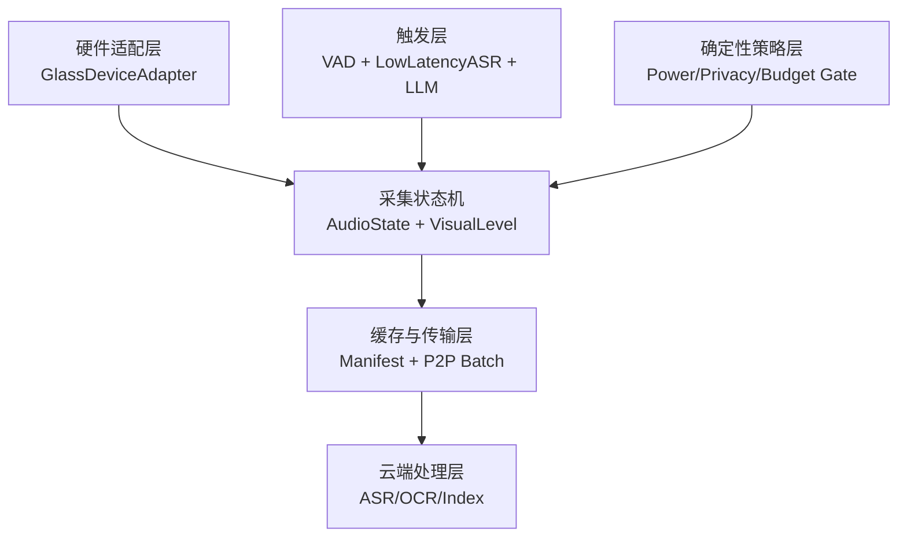
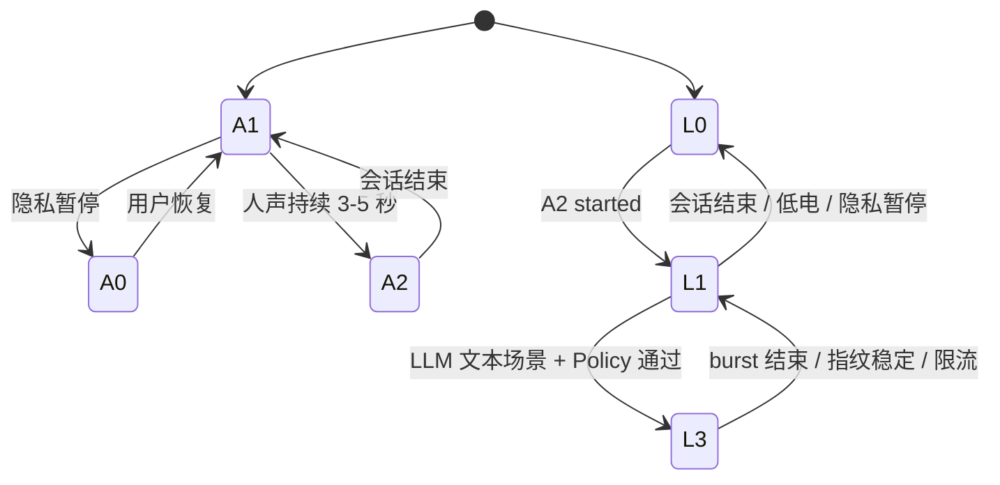
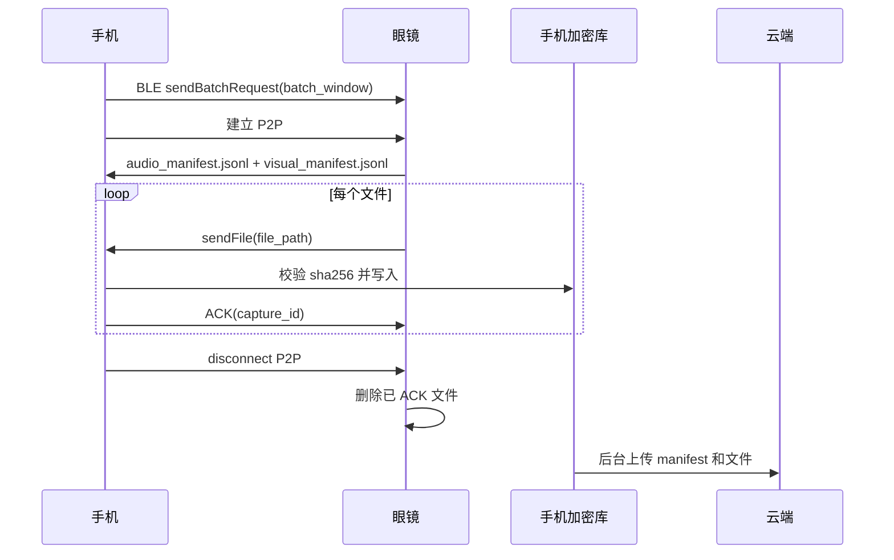

# 最简可扩展视听采集软硬件架构

版本：2026-08-19

来源策略：

- `A0 private`：用户暂停、敏感地点或隐私日程时，不保存原始音频。
- `A1 listening`：默认佩戴状态，低功耗 VAD，维护 60-120 秒加密预录环形缓存。
- `A2 conversation`：检测到持续人声后进入完整会话录音，按 60 秒切片。
- `L0 off`：视觉默认关闭。
- `L1 voice-scout`：人声激发后，每 1 分钟拍 1 张低/中分辨率静态图，延迟回传。
- `L3 scene-burst`：根据会话内容判断文本场景，短时每 1 秒拍 1 张静态图，延迟回传。

## 1. 架构目标

这份文档只设计能够实现上述采集策略的最小软硬件架构，不追求完整产品闭环。核心目标是：

1. 用最少硬件能力跑通完整会话音频和 L0/L1/L3 视觉采集。
2. 眼镜端保持低功耗，只做采集、缓存和批量传输。
3. 手机端负责状态判断、LLM 触发、功耗策略和数据中转。
4. 云端负责高质量 ASR、OCR、重建和检索入库。
5. 每个模块用接口隔离，后续可以替换硬件、模型、传输协议和存储后端。

首版不做：

- 连续视频录像。
- 眼镜端完整 OCR、ASR 或 VLM。
- 每张图片即时上传。
- 云端实时决定相机开关。
- 复杂 AR UI 或全天屏幕显示。

## 2. 最小硬件架构

```mermaid
flowchart LR
  subgraph Glass["智能眼镜最小硬件"]
    Mic["麦克风"]
    Cam["静态拍照相机"]
    Store["本地缓存<br/>音频/图片/manifest"]
    BLE["BLE 控制链路"]
    P2P["Wi-Fi P2P / 高速文件传输"]
    Battery["电量/温度遥测"]
    Indicator["录音/拍照状态提示"]
  end

  subgraph Phone["手机"]
    App["采集控制 App"]
    ASR["低延迟 ASR / 关键词"]
    LLM["Visual Trigger LLM"]
    Policy["功耗/隐私策略门"]
    Cache["加密本地库"]
    Uploader["云端上传队列"]
  end

  subgraph Cloud["云端"]
    Ingest["Ingestion API"]
    AsrJob["完整 ASR"]
    OcrJob["OCR/版面恢复"]
    Index["文本记忆索引"]
  end

  Mic --> App
  Cam --> Store
  Battery --> App
  App <-->|"低功耗控制"| BLE
  Store -->|"批量文件"| P2P
  P2P --> Cache
  App --> ASR --> LLM --> Policy
  Policy -->|"拍照/切档命令"| BLE
  Cache --> Uploader --> Ingest
  Ingest --> AsrJob --> Index
  Ingest --> OcrJob --> Index
```



### 2.1 眼镜最小能力

| 能力 | 必需性 | 用途 | 可扩展方向 |
|---|---|---|---|
| 麦克风 | 必需 | VAD、预录、完整会话音频 | 麦克风阵列、波束形成、端侧关键词 |
| 静态拍照相机 | 必需 | L1 每分钟拍照、L3 每秒拍照 | 更高分辨率、自动曝光包围、广角矫正 |
| 本地文件缓存 | 必需 | 弱网、延迟回传、ACK 后删除 | 更大缓存、硬件加密、安全区 |
| BLE 控制链路 | 必需 | 状态同步、切档命令、心跳 | 自定义低功耗协议 |
| 高速文件传输 | 必需 | 15-60 分钟批量回传图片和音频 | Wi-Fi P2P、Wi-Fi Aware、USB fallback |
| 电量/温度遥测 | 必需 | L3 限流和降级 | 更细粒度电流估算 |
| 状态提示 | 必需 | 隐私合规，提示录音或拍照 | LED、声音、HUD、手机通知 |
| IMU/按键/HUD | 可选 | 手动触发、姿态稳定、采集引导 | 文档扫描、药盒转面提示 |

眼镜端的原则是“能力刚好够”：能连续收音、按命令拍静态图、把文件可靠传给手机即可。不要把核心智能放在眼镜端，否则会直接伤害续航和热稳定性。

### 2.2 手机最小能力

| 能力 | 必需性 | 用途 | 可扩展方向 |
|---|---|---|---|
| 后台采集服务 | 必需 | 保持 A1/A2/L1/L3 状态机运行 | Android 前台服务、厂商白名单 |
| 低延迟 ASR 或关键词 | 必需 | 给 L3 触发器提供最近 10-20 秒文本 | 本地小模型、云端低延迟模型 |
| LLM 触发器 | 必需 | 根据会话内容判断是否进入 L3 | 可替换成本地 LLM、云端 LLM 或规则模型 |
| 策略门控 | 必需 | 控制功耗、隐私、冷却和配额 | 个性化策略、企业策略 |
| P2P 批量接收 | 必需 | 接收眼镜缓存的音频、图片和 manifest | 多设备同步、断点续传 |
| 加密本地库 | 必需 | 上传前保存媒体和元数据 | SQLCipher、对象加密、保留期策略 |
| 云端上传队列 | 必需 | 弱网重试、幂等上传 | 充电/Wi-Fi 条件上传 |

### 2.3 云端最小能力

| 能力 | 必需性 | 用途 | 可扩展方向 |
|---|---|---|---|
| Ingestion API | 必需 | 接收 manifest、音频分片和图片 | 签名 URL、幂等去重、多区域 |
| 完整 ASR | 必需 | 生成最终逐字稿、说话人和时间戳 | 医疗/会议领域模型 |
| OCR/版面恢复 | 必需 | 从 L1/L3 图片中恢复文字 | 表格、白板手写、药盒字段抽取 |
| 证据索引 | 必需 | 文本可回溯到音频时间和图片坐标 | RAG、审计、纠错版本 |

## 3. 最小软件分层



### 3.1 模块清单

| 位置 | 模块 | 最小职责 |
|---|---|---|
| 眼镜 | `GlassDeviceAdapter` | 封装麦克风、拍照、文件、BLE、P2P、电量和温度 |
| 眼镜 | `GlassCaptureAgent` | 执行手机下发的 `startAudio`、`takePhoto`、`sendBatch` 命令 |
| 眼镜 | `LocalManifestStore` | 为音频和图片写 manifest，维护 ACK 状态 |
| 手机 | `AudioSessionManager` | 管理 A0/A1/A2，固化预录，生成会话 ID |
| 手机 | `VisualLevelScheduler` | 管理 L0/L1/L3，计算下一次拍照时间和 burst 时长 |
| 手机 | `LowLatencyTranscriptProvider` | 输出最近 10-20 秒粗转写或关键词 |
| 手机 | `VisualTriggerLLM` | 判断会话内容是否是文本场景 |
| 手机 | `CapturePolicyGate` | 根据隐私、电量、温度、冷却和配额批准或拒绝切档 |
| 手机 | `BatchTransferManager` | 15-60 分钟触发 P2P，接收 manifest 和文件，ACK 清理 |
| 手机 | `EncryptedMediaStore` | 保存回传文件、上传状态和索引元数据 |
| 云端 | `IngestionService` | 校验分片、图片和 manifest，生成处理任务 |
| 云端 | `ConversationPipeline` | 音频拼接、ASR、说话人、时间戳 |
| 云端 | `TextImagePipeline` | 图片 OCR、去重、版面恢复、缺失区域标注 |

## 4. 核心状态机

### 4.1 音频状态机

| 状态                | 进入条件                | 采集行为                   | 退出条件              |
| ----------------- | ------------------- | ---------------------- | ----------------- |
| `A0 private`      | 用户暂停、敏感地点、隐私日程      | 不保存原始音频，不触发视觉          | 用户恢复              |
| `A1 listening`    | 默认佩戴                | 低功耗 VAD，维护 60-120 秒预录环 | 持续人声 3-5 秒进入 A2   |
| `A2 conversation` | 人声持续、多说话人、日程命中或手动开始 | 完整录音，60 秒切片，保留静音和重叠说话  | 静音 60-120 秒且上下文结束 |

最小实现中，A1 的预录环可以放在手机端。如果硬件支持眼镜本地低功耗录音，也可以放在眼镜端，但对上层暴露同一个 `PreRollAudioBuffer` 接口。

### 4.2 视觉状态机

| 状态               | 进入条件                  | 拍照策略                 | 输出                   |
| ---------------- | --------------------- | -------------------- | -------------------- |
| `L0 off`         | 默认、A0、低电、过热、无会话       | 不拍照                  | 无图片                  |
| `L1 voice-scout` | A2 已开始或持续人声命中         | 每 1 分钟 1 张低/中分辨率图    | 图片 + manifest，延迟回传   |
| `L3 scene-burst` | LLM 判断会话进入文本场景，且策略门批准 | 每 1 秒 1 张，单次 10-30 秒 | 图片序列 + manifest，延迟回传 |



视觉状态由音频状态托底：

- `A0` 时强制 `L0`。
- `A1` 默认 `L0`，只允许手动记录或强日程命中临时进入 `L1`。
- `A2` 默认 `L1`。
- `L3` 只能从 `L1` 升级，不能绕过会话和策略门控。

## 5. LLM 触发架构

LLM 只负责判断“现在是否值得进入 L3”，不能直接控制相机。实际切档必须经过确定性 `CapturePolicyGate`。

```text
recent_audio -> low_latency_transcript -> VisualTriggerLLM
                                           |
                                           v
                                   structured decision
                                           |
                                           v
power/privacy/budget/cooldown ------> CapturePolicyGate
                                           |
                                           v
                                 VisualLevelScheduler -> takePhoto
```

### 5.1 LLM 输入

```json
{
  "audio_state": "A2_conversation",
  "recent_transcript_window_sec": 15,
  "recent_transcript": "我们看一下这一页，右边这个表格里第三季度目标是多少",
  "recent_l1_image_hint": {
    "has_text": true,
    "surface_type": "screen",
    "confidence": 0.72
  },
  "calendar_context": "product review meeting",
  "power_state": {
    "battery_percent": 58,
    "thermal": "normal",
    "l3_budget_left_sec_15min": 120
  },
  "privacy_state": {
    "recording_allowed": true,
    "screen_capture_allowed": true
  }
}
```

### 5.2 LLM 输出

```json
{
  "should_trigger_l3": true,
  "scene_type": "screen_or_presentation",
  "confidence": 0.86,
  "ttl_seconds": 20,
  "reason_code": "page_or_screen_reference",
  "privacy_risk": "normal"
}
```

### 5.3 策略门控

```text
allow_l3 =
  decision.should_trigger_l3
  and decision.confidence >= 0.75
  and audio_state == A2
  and privacy_allows
  and battery_percent >= 20
  and thermal == normal
  and l3_budget_left_sec_15min > 0
  and cooldown_expired
```

LLM 可以误判，策略门不能误放。所有硬约束都在 `CapturePolicyGate` 中实现，配置可远程下发。

## 6. 延迟回传设计

延迟回传是低功耗策略的一部分。眼镜端拍照后只写本地文件和 manifest，不为每张图片单独唤醒高速链路。

### 6.1 缓存目录

```text
/capture_cache/
  /audio/
    conv_20260819_091003_0001.opus
    conv_20260819_091003_0002.opus
  /image/
    img_20260819_091530_l1_0001.jpg
    img_20260819_091612_l3_0001.jpg
  audio_manifest.jsonl
  visual_manifest.jsonl
  ack_state.json
```

### 6.2 图片 manifest

```json
{
  "capture_id": "img_20260819_091612_l3_0001",
  "conversation_id": "conv_20260819_091003",
  "visual_level": "L3",
  "sequence_no": 17,
  "captured_at_monotonic_ms": 18532188,
  "captured_at_utc": "2026-08-19T09:16:12.188+08:00",
  "trigger_reason": "llm:page_or_screen_reference",
  "resolution": "1280x720",
  "file_path": "/capture_cache/image/img_20260819_091612_l3_0001.jpg",
  "sha256": "..."
}
```

### 6.3 批量回传流程



默认回传策略：

- 标准模式：每 15 分钟批量回传一次。
- 省电模式：每 60 分钟批量回传一次。
- 高风险模式：会话结束、低电低于 15%、缓存接近上限时立即回传。
- 弱网或手机失联：眼镜继续缓存，恢复后按 `sequence_no` 补传。

## 7. 功耗预算

最简架构按“眼镜低算力、图片延迟回传、L3 严格限流”估算。这里保留中心值，方便工程参数化：

| 状态组合 | Rokid 中心电流 | Mentra 中心电流 | 说明 |
|---|---:|---:|---|
| A1 + L0 | 22mA | 15mA | 默认低功耗监听 |
| A2 + L1 | 36mA | 29mA | 完整会话 + 每分钟 1 张图 |
| A2 + L3 | 80mA | 55mA | 完整会话 + 每秒 1 张短 burst |

合理 6 小时佩戴目标：

```text
4.0h A1/L0 + 1.5h A2/L1 + 0.5h A2/L3
Rokid 平均电流 = (4.0×22 + 1.5×36 + 0.5×80) / 6 = 30.3mA
Rokid 可用容量 = 210mAh × 0.85 = 178.5mAh
Rokid 续航 = 178.5 / 30.3 = 5.9h

Mentra 平均电流 = (4.0×15 + 1.5×29 + 0.5×55) / 6 = 21.8mA
Mentra 可用容量 = 260mAh × 0.85 = 221mAh
Mentra 续航 = 221 / 21.8 = 10.1h
```

工程约束：

- L1 可以作为 A2 默认视觉保底。
- L3 在 6 小时佩戴内建议累计 20-30 分钟。
- L3 每 15 分钟默认预算 3 分钟，电量低于 40% 后减半。
- 电量低于 20% 停止自动 L3。
- 电量低于 10% 停止自动视觉，只保留会话音频。

## 8. 可扩展性设计

### 8.1 硬件适配

所有硬件差异收敛到 `GlassDeviceAdapter`：

```kotlin
interface GlassDeviceAdapter {
    suspend fun startLowPowerAudio()
    suspend fun stopAudio()
    suspend fun takePhoto(request: PhotoRequest): PhotoResult
    suspend fun listPendingFiles(window: TimeWindow): List<CaptureFile>
    suspend fun sendFile(file: CaptureFile): SendResult
    suspend fun deleteAckedFiles(ids: List<String>)
    fun observeBattery(): Flow<BatteryState>
    fun observeThermal(): Flow<ThermalState>
}
```

替换硬件时，A0/A1/A2 和 L0/L1/L3 状态机不变，只替换 adapter 实现。

### 8.2 触发器适配

`VisualTriggerProvider` 允许从规则、云端 LLM、本地 LLM 逐步演进：

```kotlin
interface VisualTriggerProvider {
    suspend fun decide(input: VisualTriggerInput): VisualTriggerDecision
}
```

首版可以先用规则和小 ASR，后续再接 LLM。无论触发器怎么换，输出必须是同一个结构化 schema，并继续由 `CapturePolicyGate` 审核。

### 8.3 策略配置

功耗和隐私策略不要写死在代码里，统一放在远程可配置策略：

```json
{
  "l1_interval_sec": 60,
  "l3_burst_default_sec": 20,
  "l3_burst_max_sec": 60,
  "l3_budget_sec_per_15min": 180,
  "l3_min_confidence": 0.75,
  "batch_transfer_interval_min": 15,
  "low_power_batch_transfer_interval_min": 60,
  "disable_l3_battery_below_percent": 20,
  "disable_auto_visual_below_percent": 10
}
```

这样可以通过真机测试逐步校准，不需要改 app 才能调参。

## 9. MVP 实施顺序

| 阶段 | 目标 | 验收 |
|---|---|---|
| M0 硬件打通 | 眼镜拍照、录音、缓存、P2P 文件传输 | 手机能收到带 manifest 的音频和图片 |
| M1 A1/A2 | VAD、预录、完整会话、60 秒音频切片 | 会话开头丢失不超过 2 秒 |
| M2 L1 | A2 期间每 1 分钟拍照，15 分钟批量回传 | 图片序号连续，ACK 后眼镜可清理 |
| M3 L3 规则版 | 基于关键词进入 1 秒拍照 burst | 文本场景触发延迟不超过 2 秒 |
| M4 L3 LLM 版 | LLM 输出结构化决策，策略门控批准 | 误触发率、漏触发率和功耗可量化 |
| M5 云端文本化 | ASR/OCR 入库，证据可回溯 | 文本可检索，能定位到音频时间和图片 |

最小可用版本建议做到 M3：先不用复杂 LLM，验证采集链路和功耗。M4 再接 LLM，解决“这一页、右边这个表格、药盒说明”等语义触发。

## 10. 验收清单

| 类别 | 指标 | 最小目标 |
|---|---|---|
| 音频 | A1 到 A2 触发 | 持续人声 3-5 秒内进入 A2 |
| 音频 | 会话开头 | 预录补齐后丢失不超过 2 秒 |
| 音频 | 分片完整性 | 60 秒切片序号连续，缺片可检测 |
| 视觉 | L0 | 非会话和隐私暂停时不拍照 |
| 视觉 | L1 | A2 期间每 60 秒拍 1 张，误差不超过 5 秒 |
| 视觉 | L3 | LLM 或规则命中文本场景后 2 秒内进入 burst |
| 视觉 | L3 限流 | 单次 10-30 秒，15 分钟预算可控 |
| 传输 | 延迟回传 | 15-60 分钟批量 P2P，ACK 后清理 |
| 功耗 | Rokid 合理混合 | 目标接近 6 小时 |
| 功耗 | 降级 | 低于 20% 停 L3，低于 10% 停自动视觉 |
| 隐私 | 用户暂停 | A0 强制 L0，不保存原始音频和图片 |

## 11. 关键架构决策

| 决策 | 结论 | 原因 |
|---|---|---|
| 智能位置 | 手机做低延迟判断，云端做重处理 | 眼镜端省电，模型可替换 |
| 视觉默认 | L0 关闭 | 续航和隐私优先 |
| 视觉保底 | A2 后 L1 每分钟拍照 | 成本低，避免完全漏掉文字载体 |
| 视觉高频 | L3 只由会话语义触发 | 把 1 秒拍照限制在高价值文本场景 |
| 回传 | 图片和音频延迟批量回传 | 减少 P2P 频繁建连和无线尾能耗 |
| LLM 权限 | LLM 只输出建议，不直接控制相机 | 稳定性、隐私和功耗必须由确定性策略保证 |
| 扩展方式 | Adapter + Provider + Policy Config | 后续换硬件、换模型、调参数都不动主状态机 |
