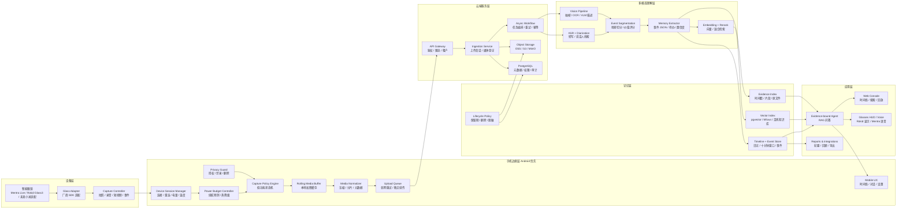
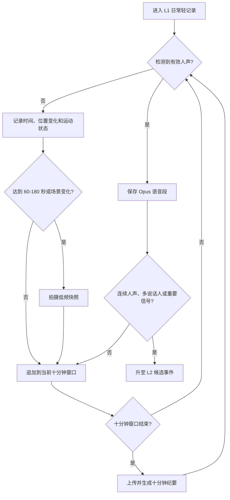
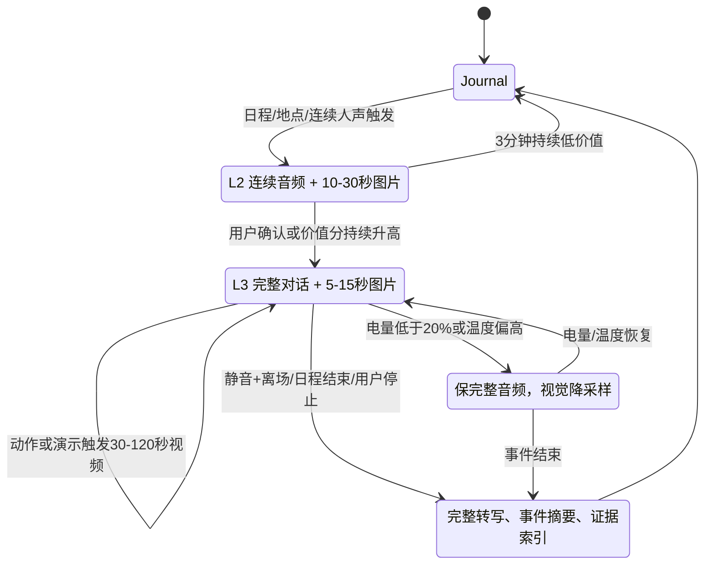
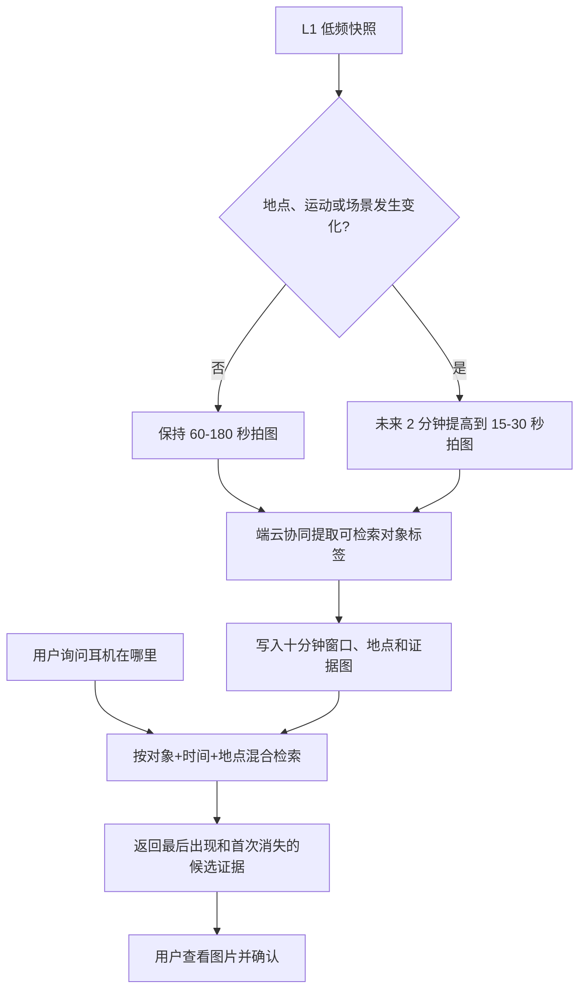
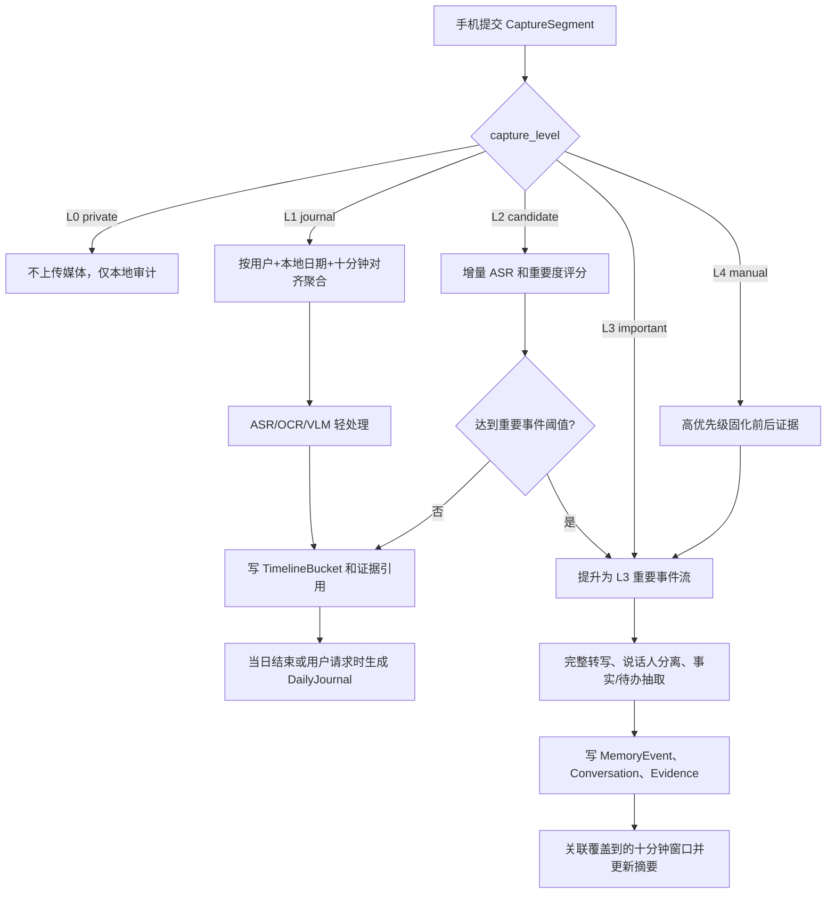
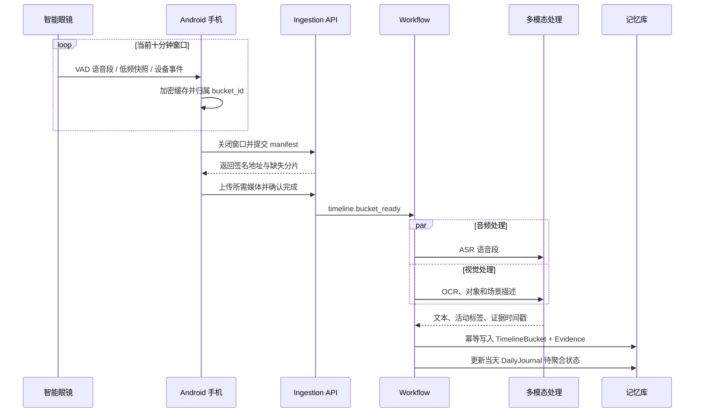
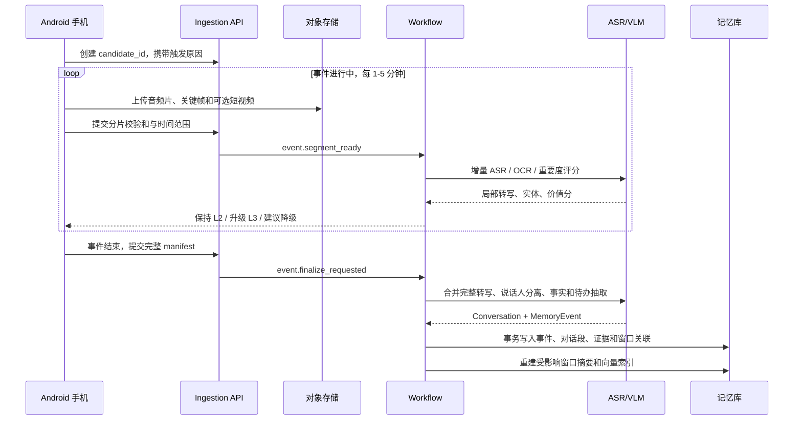
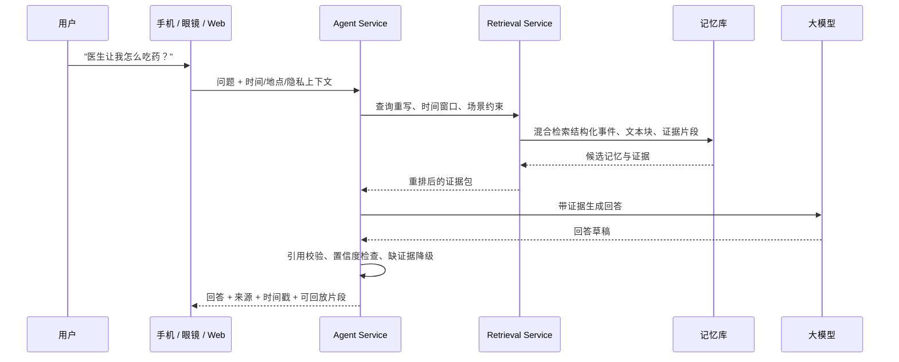
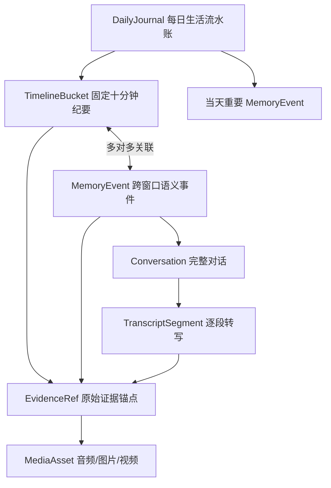

# 全天候记忆眼镜软件架构设计

版本：2026-08-18（根据脚注意见修订）  
输入资料：

- `commercial_plan/ai_glasses_memory_proposal.html`
- `hardware_selection/hardware_selection_codex.md`
- `hardware_selection/hardware_purchase_key_points.html`
- `hardware_selection/gemini_context.txt`

## 1. 架构结论

产品应按“个人生活与工作记忆层”设计，而不是按“全天候录像设备”或“AR 显示应用”设计。软件架构的核心是：

1. 眼镜和手机做低功耗、分层采集，默认不连续上传高清视频。
2. 手机作为第一中继，负责设备连接、滚动缓存、压缩、弱网上传、权限提示和轻量场景判断。
3. 云端做异步多模态理解，把音频、关键帧、短视频、OCR 和上下文抽取成结构化记忆。
4. RAG 回答必须绑定证据片段、时间戳、来源文件和置信度。
5. 硬件必须通过适配层隔离，第一阶段支持 Mentra Live 与 Rokid Glass3 两条主线，小米 AI 眼镜先作为消费化参考和预留适配目标。

首版建议建设的闭环是：

```text
眼镜采集 -> 手机中继 -> 云端处理 -> 记忆入库 -> AI 对话 -> 证据回放
```

## 2. 设计目标

### 2.1 产品目标

| 场景    | 用户问题               | 架构要求                             |
| ----- | ------------------ | -------------------------------- |
| 就医与用药 | 几日前医生告诉我的用药方法是什么？  | 长段录音、中文 ASR、说话人线索、时间戳、隐私保护、低光关键帧 |
| 物品遗失  | 耳机可能在哪里丢失？         | 低频视觉快照、地点与时间线、物体识别、路径回溯、证据图片     |
| 会议细节  | 几天前会议里提到的具体数字是多少？  | 会议开始识别、长段音频、屏幕/白板关键帧、OCR、可引用回答   |
| 通勤居家  | 闲暇时段也要轻度记录，但不能打扰用户 | 低功耗常驻、隐私开关、敏感地点禁录、降采样、后台稳定       |

### 2.2 工程目标

- 录制到可查询的 MVP 延迟控制在 5 分钟内。
- 对有活动的时段生成固定十分钟纪要，并在每天结束后聚合为可读的生活流水账。
- 重要事件保存按说话人和绝对时间排序的完整对话，摘要中的关键事实可回放到原始证据。
- 一切回答优先来自证据，不确定时明确说明没有足够证据。
- 支持多硬件切换，不让业务逻辑绑定单一厂商 SDK。
- 原始媒体、结构化记忆、向量索引和审计日志生命周期分离。
- 从第一天支持删除、禁录、保留期、导出和审计。

### 2.3 非目标

- 首版不做全天候连续高清视频录制。
- 首版不做复杂 3D AR 或全彩空间计算。
- 首版不把大模型、向量库或云厂商能力写死在业务层。
- 首版不依赖小米 AI 眼镜作为主开发设备，除非拿到明确 SDK 权限。

## 3. 总体架构



## 4. 端侧架构

### 4.1 硬件适配层

把厂商 SDK 隔离在 `GlassDeviceAdapter` 后面。业务层只理解统一能力，不直接调用 Rokid CXR、Mentra SDK 或未来小米接口。

```kotlin
interface GlassDeviceAdapter {
    val deviceInfo: DeviceInfo
    val capabilities: GlassCapabilities

    suspend fun connect(): ConnectionState
    suspend fun disconnect()
    fun observeDeviceEvents(): Flow<GlassEvent>

    suspend fun capturePhoto(options: PhotoOptions): MediaRef
    suspend fun startAudioCapture(options: AudioOptions): CaptureSession
    suspend fun stopAudioCapture(sessionId: String): MediaRef
    suspend fun recordVideoClip(options: VideoOptions): MediaRef
    suspend fun syncMedia(mediaId: String): MediaRef

    suspend fun showStatus(status: CaptureStatus)
    suspend fun playPrompt(prompt: VoicePrompt)
}
```

适配策略：

| 硬件                               | 适配重点                                   | 首版角色                      |
| -------------------------------- | -------------------------------------- | ------------------------- |
| Mentra Live                      | 相机、麦克风、按钮、触控、手机 App 控制、低功耗持续采集         | 全天候记忆采集主线，外网稳定时优先验证       |
| Rokid Glass3 / Sprite Enterprise | CXR SDK、P2P、媒体同步、实时预览、HUD 状态提示、眼镜端 APK | 国内 MVP、HUD 交互、低光与企业开发套件验证 |
| 小米 AI 眼镜                         | 等待公开或商务 SDK，先只抽象能力模型                   | 消费级形态与低光体验参考              |

### 4.2 采集状态机

采集不是单一开关，而是由 `CapturePolicyEngine` 在五个等级间切换。每次切换都记录 `reason_code`、策略版本、电量和温度，便于解释漏录原因并复盘功耗。

| 等级                   | 进入条件                                 | 音频策略                                  | 视觉策略                                    | 本地缓存与上传                                  | 退出/降级条件                                 |
| -------------------- | ------------------------------------ | ------------------------------------- | --------------------------------------- | ---------------------------------------- | --------------------------------------- |
| `L0 private`         | 用户暂停、敏感地点/日程命中                       | 不保存原音；只在设备允许时计算不可逆音量级                 | 关闭相机                                    | 清空未确认滚动缓存；只保留本地策略审计，不上传位置和环境数据           | 用户显式恢复，或离开敏感区域后再次确认                     |
| `L1 journal`         | 默认日常、通勤、居家轻记录                        | 端侧 VAD 常驻；只保存语音段，16kHz 单声道 Opus；静音不落盘 | 默认每 60-180 秒一张，地点/场景变化时临时提高到每 15-30 秒一张 | 10 分钟加密滚动窗口；窗口关闭后上传语音段、快照和低风险上下文，生成十分钟纪要 | 连续人声、多说话人、日程命中进入 L2；低电/过热退化为仅 VAD 和位置变化 |
| `L2 event_candidate` | 连续人声超过 30 秒、多说话人、会议/就医日程、地点变化、重要对象出现 | 连续保存音频，按 5 分钟切片；端侧保留前 2 分钟预录          | 每 10-30 秒一张；白板、屏幕、药盒等变化时立即拍照            | 每 1-5 分钟上传候选片段并做流式 ASR；尚不默认保存连续视频        | 价值分连续 2 分钟高于阈值进入 L3；连续 3 分钟低于阈值回到 L1    |
| `L3 important_event` | 用户确认、日程强匹配、关键词/对象命中且价值分高             | 完整对话连续保存，按 5 分钟无损时间线切片；说话人分离在云端完成     | 每 5-15 秒一张；只在动作/演示需要时录 30-120 秒视频       | 音频和关键帧实时分片上传；事件结束后生成完整转写、事件摘要和证据索引       | 30 秒静音加离场信号、日程结束、用户停止；低电或过热时关闭视频但保持音频   |
| `L4 manual_mark`     | 眼镜按键、语音“记住这里”、手机快捷操作                 | 固化触发前 2 分钟和触发后 3 分钟音频，可由用户延长为完整事件     | 固化前后关键帧；可选触发 30 秒视频                     | 最高优先级上传，并与所在十分钟窗口及重要事件双向关联               | 标记窗口结束；若用户选择“继续记录”则转 L3                 |

策略细节：

- `L1` 是全天候默认模式，但“全天候”指全天可用的低功耗感知，不等于全天保存原始音视频。
- 十分钟是整理和检索窗口，不是媒体文件长度。音频按 1-5 分钟切片，视频按 30-120 秒切片，避免单文件损坏影响整个时段。
- 场景判定使用人声密度、说话人数、日程、位置、运动、Wi-Fi/BLE、视觉变化、关键词和手动信号；所有信号只形成建议，用户暂停拥有最高优先级。
- 状态切换采用迟滞阈值，升档需连续满足条件，降档需持续低价值，防止相机和网络频繁启停。
- 手机失联时继续写入加密环形缓存；存储达到 80% 先删除未标记的 L1 原始媒体，绝不删除已确认的重要事件。

### 4.3 功耗预算与持续时间预测

首轮规划基于 Mentra Live 260mAh、Rokid Glass3 210mAh，并按 85% 可用容量估算。公式为：

```text
预计持续时间（小时） = 电池容量（mAh） × 0.85 ÷ 场景实测平均电流（mA）
```

下表是尚未拿真机压测前的工程预算，不是厂商承诺。区间已用 Mentra “12+ 小时混合使用、连续视频 1+ 小时”的公开口径做量级校验；充电盒只增加总可用时长，不算连续佩戴时长。

| 工作负载                 | 采集占空比                          | Mentra 规划电流 / 单次续航     | Rokid 规划电流 / 单次续航      | 适用场景          |
| -------------------- | ------------------------------ | ---------------------- | ---------------------- | ------------- |
| `L0 private`         | BLE 心跳、相机/麦克风关闭                | 6-10mA / 22-37 小时      | 6-10mA / 18-30 小时      | 敏感地点、睡眠、明确暂停  |
| `L1 journal`         | VAD 常驻、语音段落盘、每 60-180 秒拍图、批量上传 | 18-26mA / 8.5-12.3 小时  | 24-34mA / 5.2-7.4 小时   | 通勤、居家、普通工作日   |
| `L2 event_candidate` | 连续音频、每 10-30 秒拍图、间歇上传          | 38-55mA / 4.0-5.8 小时   | 50-75mA / 2.4-3.6 小时   | 疑似会议、购物、就医候选段 |
| `L3 important_event` | 连续音频、每 5-15 秒拍图、约 10% 视频占空比    | 65-95mA / 2.3-3.4 小时   | 80-120mA / 1.5-2.2 小时  | 完整会议、问诊、重要谈话  |
| 连续视频上限               | 1080p 视频持续编码和传输                | 190-250mA / 0.9-1.2 小时 | 190-280mA / 0.6-0.9 小时 | 只用于压测，不作为产品模式 |

按表中较低负载估算，Mentra 的单次可行组合约为 7 小时 `L1` + 1 小时 `L3`，消耗约 191mAh；Rokid 约为 4 小时 `L1` + 1 小时 `L3`，消耗约 176mAh，已接近可用容量上限。因此 10-12 小时全天记录需要 Mentra 控制重要事件时长并结合充电盒，Rokid 则应安排午间补电或进一步降低拍图频率。真机接入后，`PowerBudgetController` 每 5 分钟用电量变化、温度和各传感器占空比更新 EWMA 模型，给出 `remaining_minutes`：

- 电量高于 40%：按场景正常升降级。
- 20%-40%：禁止连续预览，视频片段最长 30 秒，图片频率上限为每 15 秒一张。
- 10%-20%：只保留连续音频和每 60 秒一张图片；优先完成当前重要事件。
- 低于 10% 或达到设备温控阈值：停止视觉并冲刷上传队列；非敏感场景保留 `L1` 的纯音频受限子模式，敏感场景进入 `L0`。

真机验收必须分别记录待机、VAD、录音、拍图、编码、P2P 和上传的增量电流；若实测与表中区间偏差超过 20%，立即更新策略配置，不把估算常量写死在 App。

### 4.4 分场景采集流程

#### 日常流水账、通勤与居家



#### 会议、就医与重要谈话



#### 物品遗失回溯



### 4.5 Android 手机 App 模块

| 模块 | 职责 |
|---|---|
| `DeviceSessionService` | 扫描、配对、连接、重连、固件/SDK 版本识别、能力发现 |
| `CapturePolicyEngine` | 运行采集状态机，合并传感器、规则和用户设置 |
| `PowerBudgetController` | 统计传感器占空比、电量和温度，预测剩余时间并触发降级 |
| `RollingMediaBuffer` | 本地加密缓存音频、图片、短视频和元数据，支持断电恢复 |
| `TimelineWindowAssembler` | 将片段归入确定性的十分钟窗口，维护事件跨窗口关联 |
| `MediaNormalizer` | 编码统一、压缩、抽首帧、生成校验和、切片 |
| `UploadQueue` | 弱网排队、断点续传、去重、失败重试、后台任务 |
| `PrivacyGuard` | 授权、禁录区域、敏感词策略、删除请求、本地清除 |
| `LocalTimeline` | 在云端处理未完成时提供本地时间线和上传状态 |
| `AgentClient` | 与云端对话、拉取引用证据、播放或显示回答 |

端侧存储建议：

- SQLite/Room 保存元数据、上传任务、状态机事件。
- 文件系统保存短期媒体缓存，使用系统 Keystore 加密密钥。
- 默认缓存上限按时间和空间双限制，例如 24 小时或 5GB，可由用户调整。

## 5. 云端架构

### 5.1 服务划分

| 服务 | 职责 | MVP 技术建议 |
|---|---|---|
| API Gateway | 鉴权、限流、租户、设备令牌、请求审计 | FastAPI 或 NestJS |
| Upload Service | 创建上传会话、签名 URL、分片登记、去重 | OSS/S3 Multipart |
| Media Catalog | 管理媒体、片段、会话、设备、时间线元数据 | PostgreSQL |
| Workflow Service | 编排 ASR、抽帧、OCR、VLM、抽取、入库 | Redis Queue / Celery / Dramatiq |
| AI Processing Workers | 调模型处理音频、图像、视频摘要和结构化抽取 | Python workers |
| Memory Service | 事件写入、schema 校验、冲突合并、权限过滤 | PostgreSQL + JSONB |
| Timeline Service | 十分钟窗口定稿、迟到数据修订、每日流水账聚合 | PostgreSQL + async workers |
| Retrieval Service | 混合检索、时间过滤、重排、证据拼装 | pgvector / Milvus / 百炼知识库 |
| Agent Service | 对话编排、引用约束、回答生成、追问 | LLM gateway |
| Privacy Service | 删除、保留期、脱敏、导出、审计 | 独立策略服务 |
| Admin/Web API | 时间线、搜索、证据回放、成本监控 | REST + WebSocket/SSE |

### 5.2 推荐部署

MVP 优先使用国内云闭环，减少联调摩擦：

- 对象存储：阿里云 OSS，开发环境可用 MinIO。
- 元数据：PostgreSQL/RDS，结构化事件与审计日志放同一套关系库。
- 向量索引：MVP 可选百炼知识库加速；若要减少锁定，使用 PostgreSQL + pgvector。
- 队列：Redis Queue、Celery 或 Dramatiq。进入多客户 PoC 后再评估 Temporal。
- 模型：DashScope/百炼做 ASR、VLM、Embedding、Rerank、LLM，对外保留 `ModelProvider` 抽象。
- Web 控制台：Next.js 或轻量 React SPA。
- 移动端：Android Kotlin + Jetpack Compose，iOS 后置。

## 6. 数据流

### 6.1 按采集模式分流

采集片段必须携带 `capture_level`、`bucket_id`、可选的 `event_id/conversation_id`、策略版本和触发原因。服务端以这些字段选择处理流，不能再根据文件类型猜测业务含义。

| 模式 | 入库粒度 | 处理时机 | 主要处理 | 最终写入 |
|---|---|---|---|---|
| `L0 private` | 无媒体入库 | 不调用云端 | 手机本地记录策略切换和原因；不记录敏感地点详情 | 本地审计；云端仅可选写入匿名设备健康指标 |
| `L1 journal` | 固定十分钟窗口；内部含 1-5 分钟音频片和低频快照 | 窗口结束后 2 分钟内批量处理 | ASR、OCR、视觉描述、活动分类、低价值片段压缩 | `timeline_buckets`、证据引用；当日结束后聚合为 `daily_journals` |
| `L2 event_candidate` | 候选事件；音频每 5 分钟切片，图片 10-30 秒 | 流式预处理，事件退出时决策 | 增量 ASR、场景/人物/对象识别、重要度评分 | 低价值时并回十分钟窗口；高价值时提升为正式 `memory_event` |
| `L3 important_event` | 一个语义事件，可跨多个十分钟窗口 | 采集中增量处理，结束后全量定稿 | 完整 ASR、说话人分离、关键帧/OCR、事实和待办抽取 | `memory_events`、`conversations`、`transcript_segments`、`evidence_refs`，并回写关联窗口 |
| `L4 manual_mark` | 前 2 分钟 + 后 3 分钟证据包，或用户延长的事件 | 立即高优先级处理 | 快速 ASR/VLM、人工标记保留、与相邻事件去重 | 重要事件和证据；`importance=manual`，默认不被自动降级或短期清理 |



### 6.2 `L1 journal` 十分钟窗口入库流



窗口采用用户本地时区对齐，例如 `09:10:00-09:19:59`。无有效语音、无视觉变化且无位置变化的窗口只写“无显著活动”状态，不上传空白媒体，也不调用大模型。

### 6.3 `L2/L3` 候选与重要事件入库流



`L2` 未达到重要阈值时不丢弃已处理信息，而是将片段并入对应的 `timeline_bucket`；升级到 `L3` 后沿用同一个 `candidate_id` 作为幂等键，避免重复上传和重复记忆。

### 6.4 `L4 manual_mark` 优先入库流

手动标记发生时，手机冻结环形缓存中的前 2 分钟，再补录后 3 分钟，立即创建 `importance=manual` 的事件。若其时间范围与正在进行的 L2/L3 事件重叠超过 60%，则只增加手动标记和证据锚点，不再创建重复事件；用户选择“继续记录”时，事件保持 L3 直到手动结束。

### 6.5 对话召回流



## 7. 记忆数据模型

### 7.1 记忆层次与覆盖结论

原设计的 `MemoryEvent` 已覆盖“重要事件摘要、事实、待办和证据”，但没有把每日流水账、固定十分钟纪要和完整对话定义成独立实体。修订后采用四层模型：



- `DailyJournal` 是一天的可读总览，按时间顺序引用十分钟窗口和重点事件。
- `TimelineBucket` 是稳定的时间骨架，即使没有重要事件，也能形成生活流水账；只为有活动或有信号的窗口调用模型。
- `MemoryEvent` 是跨窗口的语义事件，例如 09:08-09:42 的会议可关联 4 个十分钟窗口。
- `Conversation` 保存重要事件的完整对话索引，正文拆成不可变的 `TranscriptSegment`，便于校正说话人和精确引用。
- 摘要不替代原始证据。每日总览、十分钟纪要和事件摘要都只保存引用，不复制完整转写。

### 7.2 核心表

| 表 | 作用 |
|---|---|
| `users` | 用户账号、时区、隐私偏好、默认保留期 |
| `devices` | 眼镜型号、SDK 版本、能力集、绑定状态 |
| `capture_sessions` | 一次佩戴周期，例如全天佩戴、上午通勤 |
| `capture_segments` | 端侧上传的音频片、快照包、短视频及 `capture_level/bucket_id/event_id` |
| `media_assets` | 原始音频、图片、视频、关键帧和转码文件 |
| `timeline_buckets` | 按用户本地时区对齐的十分钟窗口、纪要、活动和覆盖度 |
| `daily_journals` | 每日生活流水账、重点事件、缺失时段和生成版本 |
| `memory_events` | 重要语义事件、事实、人物、地点、待办和重要度 |
| `event_bucket_links` | 事件与十分钟窗口的多对多关系及时间重叠比例 |
| `conversations` | 重要事件完整对话的范围、语言、说话人数和定稿状态 |
| `transcript_segments` | 逐段原文、说话人、绝对时间、置信度和证据引用 |
| `memory_chunks` | 用于全文和向量检索的摘要、转写及 OCR 文本块 |
| `evidence_refs` | 文件、绝对时间、媒体内偏移、帧号和置信度 |
| `processing_jobs` | ASR、OCR、VLM、Embedding 和聚合任务状态 |
| `capture_policy_transitions` | 采集等级变化、原因、电量、温度和策略版本 |
| `privacy_rules` | 禁录地点、敏感场景、保留期和共享权限 |
| `audit_logs` | 查看、导出、删除、模型调用和管理员操作 |

### 7.3 `TimelineBucket`：十分钟事件纪要

```json
{
  "bucket_id": "usr_01_20260818T0910+0800",
  "user_id": "usr_01",
  "local_date": "2026-08-18",
  "timezone": "Asia/Shanghai",
  "time_range": {
    "start": "2026-08-18T09:10:00+08:00",
    "end": "2026-08-18T09:20:00+08:00"
  },
  "activity_type": "medical_visit",
  "summary": "在社区医院与医生沟通感冒症状和用药方法。",
  "event_ids": ["evt_01"],
  "conversation_ids": ["conv_01"],
  "evidence_ref_ids": ["evr_01", "evr_02"],
  "coverage": {
    "audio_seconds": 548,
    "image_count": 12,
    "missing_seconds": 52
  },
  "status": "final",
  "revision": 2
}
```

`bucket_id` 由用户、时区和窗口开始时间确定，保证重复提交幂等。迟到媒体到达后将 `status` 改为 `revising`，重新生成纪要并增加 `revision`；旧版本进入审计历史，不直接覆盖得不可追溯。

### 7.4 `MemoryEvent` 与完整对话

```json
{
  "memory_event_id": "evt_01",
  "user_id": "usr_01",
  "time_range": {
    "start": "2026-08-18T09:08:32+08:00",
    "end": "2026-08-18T09:42:10+08:00"
  },
  "scene_type": "medical",
  "importance": "high",
  "capture_level": "L3",
  "title": "社区医院就诊与用药说明",
  "summary": "医生说明了感冒药服用频率和注意事项。",
  "bucket_ids": [
    "usr_01_20260818T0900+0800",
    "usr_01_20260818T0910+0800",
    "usr_01_20260818T0920+0800",
    "usr_01_20260818T0930+0800",
    "usr_01_20260818T0940+0800"
  ],
  "conversation_id": "conv_01",
  "facts": [
    {
      "type": "medication_instruction",
      "content": "饭后服用，每天两次。",
      "confidence": 0.78,
      "evidence_ref_ids": ["evr_01"]
    }
  ],
  "privacy_level": "private",
  "retention_policy": "keep_until_user_deletes"
}
```

完整对话不以内嵌大 JSON 保存，而使用一条 `conversations` 主记录和按时间排序的 `transcript_segments`：

```json
{
  "transcript_segment_id": "tr_0187",
  "conversation_id": "conv_01",
  "speaker": {"speaker_id": "spk_02", "display_name": "未知医生"},
  "time_range": {
    "start": "2026-08-18T09:21:08.000+08:00",
    "end": "2026-08-18T09:21:31.000+08:00"
  },
  "text": "饭后服用，每天两次。",
  "confidence": 0.78,
  "evidence_ref_id": "evr_01",
  "revision": 1
}
```

### 7.5 `DailyJournal`：每日生活流水账

`DailyJournal` 在用户本地日期结束后生成，也允许白天按需增量预览。它按窗口组织当天活动，突出重要事件，并明确显示漏录时段，避免模型把空白时间编造成经历。

```json
{
  "daily_journal_id": "journal_usr_01_2026-08-18",
  "user_id": "usr_01",
  "local_date": "2026-08-18",
  "timezone": "Asia/Shanghai",
  "headline": "上午就医，下午完成项目评审，晚间居家休息。",
  "periods": [
    {
      "time_range": "09:10-09:20",
      "bucket_id": "usr_01_20260818T0910+0800",
      "summary": "在社区医院说明症状并听取用药建议。",
      "event_ids": ["evt_01"]
    }
  ],
  "highlight_event_ids": ["evt_01", "evt_02"],
  "coverage": {
    "active_bucket_count": 46,
    "captured_minutes": 421,
    "missing_ranges": ["12:30-13:20"]
  },
  "status": "final",
  "revision": 3
}
```

### 7.6 证据模型

证据必须独立建模，避免回答只引用摘要。绝对时间用于跨文件时间线，媒体内偏移用于精确回放：

```json
{
  "evidence_ref_id": "evr_01",
  "memory_event_id": "evt_01",
  "bucket_id": "usr_01_20260818T0920+0800",
  "media_asset_id": "aud_01",
  "modality": "audio",
  "absolute_time_range": {
    "start": "2026-08-18T09:21:08.000+08:00",
    "end": "2026-08-18T09:21:31.000+08:00"
  },
  "media_offset": {"start_ms": 128000, "end_ms": 151000},
  "transcript": "饭后服用，每天两次。",
  "confidence": 0.78,
  "storage_uri": "oss://bucket/users/usr_01/2026/08/18/aud_01.m4a"
}
```

## 8. API 草案

### 8.1 手机端 API

| 方法 | 路径 | 用途 |
|---|---|---|
| `POST` | `/v1/device-bindings` | 绑定眼镜和手机 |
| `POST` | `/v1/capture-sessions` | 创建佩戴或任务会话 |
| `POST` | `/v1/upload-sessions` | 创建媒体上传会话并返回签名 URL |
| `POST` | `/v1/capture-segments` | 提交片段元数据、校验和、时间范围 |
| `POST` | `/v1/manual-marks` | 固化前后滚动缓存，创建高优先级标记 |
| `GET` | `/v1/processing-jobs/{job_id}` | 查询处理状态 |
| `GET` | `/v1/timeline?date={date}` | 拉取十分钟时间线和重要事件 |
| `GET` | `/v1/daily-journals/{date}` | 获取每日生活流水账及覆盖度 |
| `GET` | `/v1/conversations/{id}/transcript` | 分页获取完整对话及证据时间戳 |
| `PATCH` | `/v1/transcript-segments/{id}` | 用户修正说话人或转写文本，保留修订历史 |
| `POST` | `/v1/chat` | 发起证据化问答 |
| `DELETE` | `/v1/memories/{memory_event_id}` | 删除记忆及相关索引 |
| `DELETE` | `/v1/timeline-buckets/{bucket_id}` | 删除一个十分钟窗口及其私有证据，并重建当日日记 |
| `POST` | `/v1/privacy-rules` | 设置禁录、保留期和敏感地点规则 |

### 8.2 内部事件

| 事件 | 触发时机 |
|---|---|
| `media.received` | 片段上传完成 |
| `timeline.bucket_ready` | 十分钟窗口关闭且所需媒体到齐 |
| `timeline.bucket_finalized` | 十分钟纪要和证据完成入库 |
| `daily_journal.generate_requested` | 当日结束、窗口修订或用户请求重新生成 |
| `event.segment_ready` | 候选/重要事件的新片段可增量处理 |
| `event.finalize_requested` | 事件结束，需要定稿完整对话和事件摘要 |
| `asr.completed` | 音频转写完成 |
| `vision.completed` | 抽帧、OCR、视觉描述完成 |
| `segment.scored` | 事件分段和价值评分完成 |
| `conversation.finalized` | 完整对话已合并、排序并通过连续性检查 |
| `memory.extracted` | 结构化记忆生成完成 |
| `memory.indexed` | 结构化库和向量库写入完成 |
| `privacy.delete_requested` | 用户请求删除 |
| `retention.expired` | 媒体或记忆达到保留期 |

## 9. RAG 与 Agent 设计

### 9.1 检索策略

采用混合检索，不只依赖向量：

1. 时间过滤：用户问题常有“几天前”“上周会议”“下班路上”等时间线索。
2. 场景过滤：就医、会议、通勤、购物、居家、工作。
3. 结构化过滤：人物、地点、设备、项目、客户、药品、数字。
4. 分层召回：先查 `DailyJournal/TimelineBucket` 缩小日期和时段，再查 `MemoryEvent/TranscriptSegment` 获取细节。
5. 向量召回：摘要、ASR 文本、OCR 文本、关键帧描述。
6. 全文检索：精确数字、药名、地名和专有名词。
7. 重排：优先选择时间接近、证据完整、置信度高的片段。

### 9.2 回答约束

Agent 必须遵守以下规则：

- 每个关键结论至少绑定一个 `evidence_ref`。
- 回答里展示时间、来源、证据类型和可回放入口。
- 没有证据时回答“没有找到足够证据”，并建议可查看的时间范围。
- 医疗、法律、财务等高风险内容只做历史记录召回，不替代专业建议。
- 用户删除或禁用的记忆不得被检索或用于上下文。

## 10. 隐私、安全与合规设计

| 能力 | 首版要求 |
|---|---|
| 录制提示 | 手机和眼镜端显示当前记录状态，Rokid 可用 HUD，Mentra 可用手机/语音提示 |
| 用户控制 | 一键暂停、敏感地点禁录、手动删除、批量清除 |
| 本地加密 | 端侧缓存加密，上传队列不保存明文密钥 |
| 传输安全 | HTTPS、签名 URL、短期凭证、分片校验 |
| 存储安全 | 对象存储私有桶、服务端加密、按用户或租户隔离 |
| 权限过滤 | 检索和回放都经过用户、租户、项目和隐私级别过滤 |
| 生命周期 | 原始视频短保留，文本记忆长保留，用户可覆盖策略 |
| 审计 | 记录查看、导出、分享、删除、管理员操作和模型处理记录 |
| 脱敏 | 后续支持人脸模糊、敏感词标注、联系人和地点匿名化 |

建议默认保留策略按记录价值分层：L1 原始语音和普通快照保留 7 天，十分钟纪要和每日流水账长期保留；L3/L4 完整转写长期保留，作为关键证据的原始音频默认保留 90 天，用户可设为长期保留；非关键短视频默认 30 天。删除某个窗口或事件时，先解除共享证据引用，只在引用计数归零后删除媒体对象，随后重建当日日记和检索索引。

## 11. MVP 范围

### 11.1 首版交付物

1. 1 个硬件主适配器：Mentra Live 或 Rokid Glass3 二选一优先跑通，另一个保留接口和基础 stub。
2. 1 个 Android 手机中继 App：连接设备、L0-L4 策略、功耗预测、十分钟窗口、滚动缓存、上传队列和隐私设置。
3. 1 个云端处理服务：上传、对象存储、异步处理、ASR、抽帧、OCR、VLM 摘要和每日聚合。
4. 1 个记忆库：每日流水账、十分钟纪要、重要事件、完整对话、证据引用和向量索引。
5. 1 个对话台：手机或 Web 上可以浏览每日时间线、查看完整对话、提问和回放证据。

### 11.2 8 周路线

| 周期 | 目标 | 输出 |
|---|---|---|
| 第 1-2 周 | 场景和硬件联调 | 选 1 个核心场景，跑通设备连接、拍照、录音、文件同步 |
| 第 3-4 周 | 端侧采集与上传 | L0-L4 状态机、功耗遥测、十分钟窗口、滚动缓存、分片上传、隐私开关 |
| 第 5-6 周 | 云端理解与记忆入库 | 十分钟纪要、每日流水账、完整对话、MemoryEvent、证据和向量索引 |
| 第 7 周 | RAG 对话与证据回放 | 可提问、可引用、可回放，回答带时间戳 |
| 第 8 周 | 真实场景试用 | 就医/会议/物品遗失模拟测试，统计延迟、召回、成本、稳定性 |

### 11.3 建议优先场景

个人记忆产品的 MVP 建议优先选择“会议细节 + 就医用药”二选一：

- 会议细节更容易组织测试数据，音频和屏幕关键帧价值明确。
- 就医用药价值更强，但隐私和合规要求更高，需要更严格的授权和删除流程。

“耳机在哪里丢失”适合第二阶段，因为它依赖更长时间的低频视觉、地点连续性和物体识别，端侧功耗与误报更难。

## 12. 推荐代码仓库结构

```text
glass_agent/
  apps/
    android/
      app/
      glass-adapters/
        adapter-core/
        adapter-mentra/
        adapter-rokid/
        adapter-mock/
    web-console/
  services/
    api/
    workers/
    agent/
  packages/
    protocol/
    memory-schema/
    model-provider/
  infra/
    docker-compose.yml
    aliyun/
  docs/
    api/
    privacy/
    test-scenarios/
  software_architecture/
    memory_glasses_software_architecture.md
```

## 13. 测试与验收

### 13.1 工程测试

- 设备适配器 contract test：同一套测试跑 Mentra、Rokid 和 mock adapter。
- 上传幂等测试：重复提交同一片段不会生成重复记忆。
- 时间窗口测试：跨时区、跨零点、迟到媒体和事件跨多个十分钟窗口时，结果稳定且可修订。
- 对话连续性测试：乱序和重复音频片合并后，完整转写无重复、时间单调且缺口可见。
- 功耗模型测试：每种采集负载持续 60 分钟，预测耗电与实测偏差不超过 20%。
- 弱网测试：飞行模式、网络切换、低电量、锁屏后恢复。
- 隐私删除测试：删除后对象存储、数据库、向量库、缓存都不可召回。
- 回答引用测试：每个回答必须包含证据，否则判为失败。

### 13.2 场景验收

| 指标 | MVP 目标 |
|---|---|
| 录制到可查询延迟 | 小于 5 分钟 |
| 上传成功率 | 正常网络下大于 95% |
| 关键事件召回 | 目标场景大于 80% |
| 十分钟纪要覆盖 | 有效采集窗口 95% 在关闭后 5 分钟内可查询 |
| 完整对话连续性 | 非设备断流造成的转写时间缺口小于 1% |
| 回答可引用率 | 关键回答 100% 带证据 |
| L1 单次续航 | Mentra 不低于 8.5 小时；Rokid 不低于 5 小时，未达标则降低视觉频率 |
| 功耗预测误差 | 校准后剩余时间预测误差不超过 20% |
| 本地缓存恢复 | App 重启后上传队列可恢复 |
| 用户控制 | 暂停、删除、禁录立即生效 |
| 成本观测 | 可按用户、天、模型、媒体类型统计 |

## 14. 后续演进

| 阶段 | 演进方向 |
|---|---|
| MVP 后 | 支持 Mentra 与 Rokid 双适配器、更多自动触发规则、Web 时间线 |
| PoC 阶段 | 多用户、多设备、共享空间、行业报告模板、企业权限域 |
| 商业化阶段 | 私有化部署、模型路由、成本优化、人脸/车牌/敏感信息脱敏 |
| 长期 | 个人知识图谱、跨设备记忆、主动提醒、离线小模型、端侧摘要 |

## 15. 关键决策记录

| 决策 | 结论 | 原因 |
|---|---|---|
| 采集方式 | 分层采集，不做连续高清视频 | 续航、发热、隐私和云成本都不允许长期高码率录像 |
| 手机角色 | Android 手机作为第一中继 | 降低眼镜功耗，统一上传、缓存、权限和网络能力 |
| 硬件策略 | 适配层支持多硬件 | Mentra 更适合全天候采集，Rokid 更适合国内 MVP 和 HUD |
| 云端处理 | 异步管线 | ASR、OCR、VLM、Embedding 都有耗时和失败重试需求 |
| 记忆模型 | 每日日记 + 十分钟窗口 + 语义事件 + 完整对话 + 证据 | 同时覆盖生活流水、重要事件和细节追溯，避免一个实体承担所有粒度 |
| Agent 输出 | 证据绑定回答 | 个人记忆产品的信任来自可回放证据，不是模型口吻 |
| 隐私 | 架构级能力，不是 UI 附加项 | 禁录、删除、保留期和审计必须贯穿端侧、云端、检索和回放 |
| 功耗 | 运行时预测并按电量/温度降级 | 固定拍摄频率无法适应不同设备、电池老化、网络和场景负载 |
