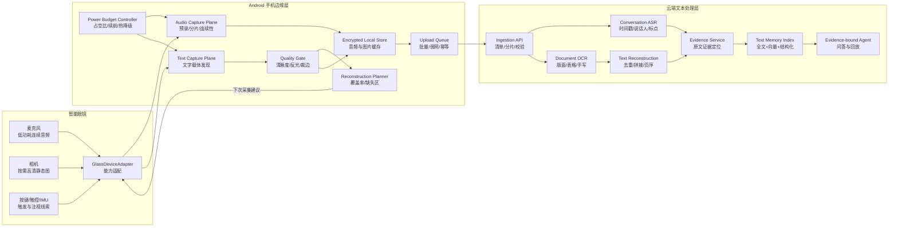
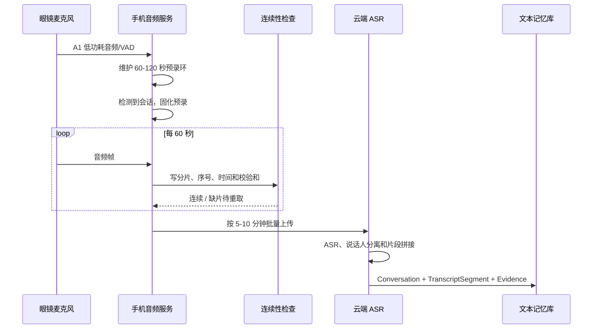
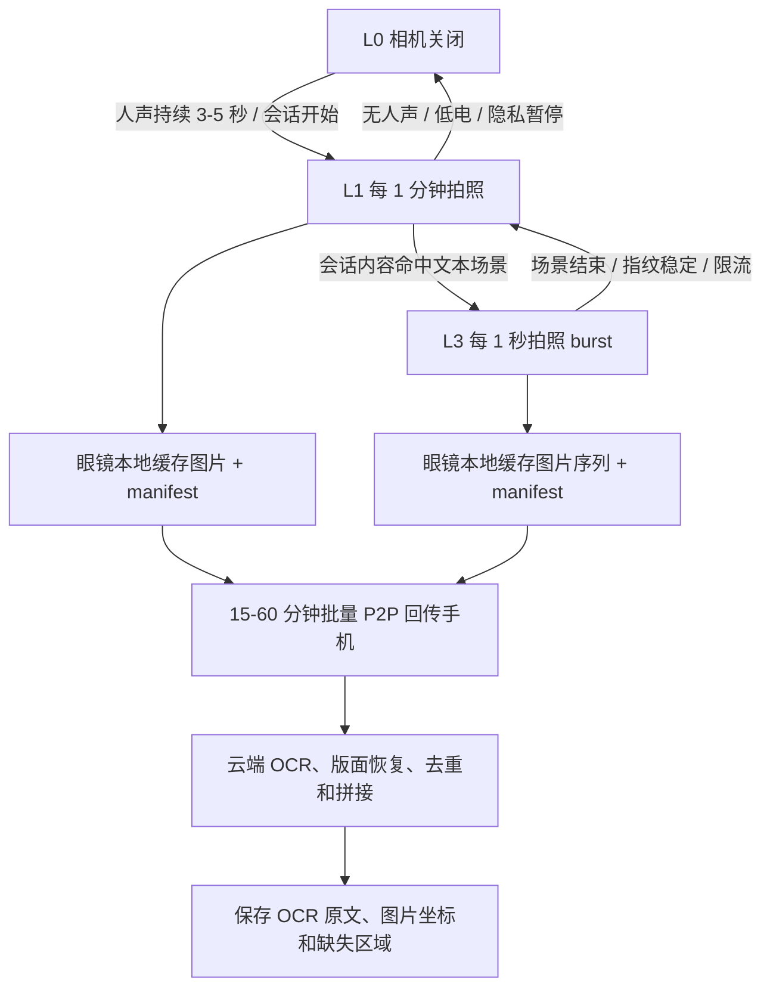
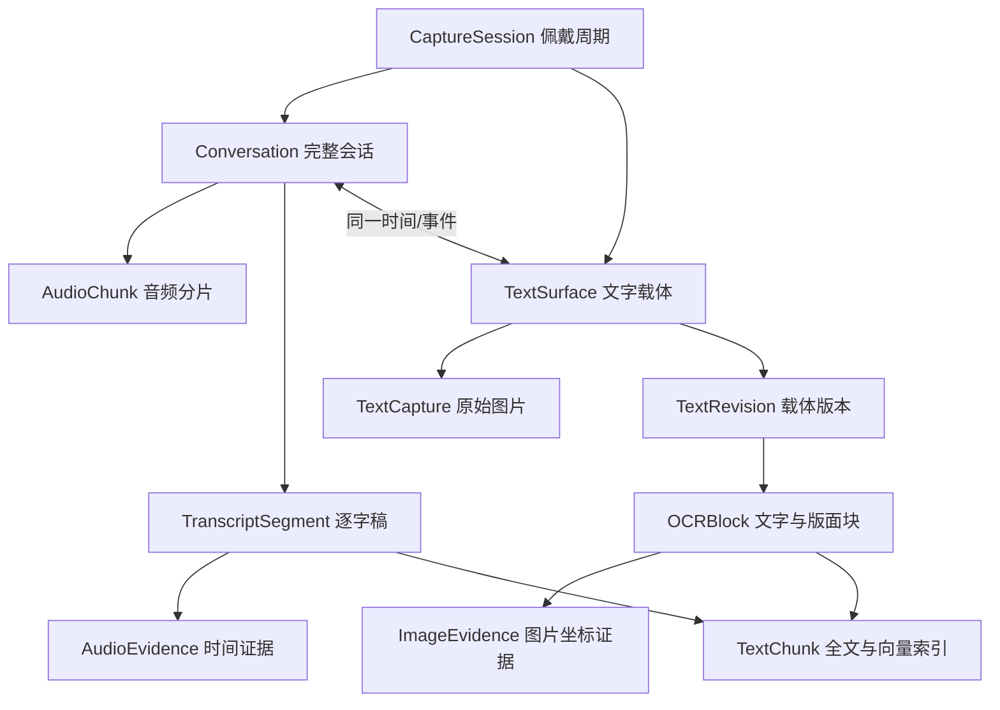

# 文本优先的全天候记忆眼镜软件架构

版本：2026-08-19  
定位：完整会话采集 + 视觉文字完整采集 + 低功耗长续航

输入资料：

- `commercial_plan/ai_glasses_memory_proposal.html`
- `hardware_selection/hardware_selection_codex.md`
- `hardware_selection/hardware_purchase_key_points.html`
- `software_architecture/memory_glasses_software_architecture.md`

## 1. 架构结论

这一版将产品从“多模态生活记录器”收敛为“可检索的个人文本记忆层”：

1. 音频是主数据源。检测到会话后，优先保证从开头到结束的连续音频、完整转写、说话人和时间戳。
2. 视觉的目标不是记录环境，而是尽可能还原用户看过的文字，包括屏幕、白板、纸质文档、标签和药品包装。
3. 视频默认关闭。视觉采用 `L0/L1/L3` 静态拍照策略：默认关闭，人声后 1 分钟低频采样，会话语义命中文本场景后短时 1 秒采样，并全部延迟回传。
4. 眼镜只负责采集和即时触发，手机负责缓存、轻量检测、质量判断和上传，云端负责高质量 ASR、OCR、版面恢复和检索入库。
5. 产品以“文字覆盖率”和“会话连续性”作为核心指标，而不是照片数量、录像时长或视觉模型描述数量。

首版主链路：

```text
完整会话 -> 分片音频 -> ASR/说话人分离 -> 可引用逐字稿
文字载体 -> L1/L3 静态照片序列 -> 延迟回传 -> OCR/版面恢复 -> 可引用原文
逐字稿 + OCR 原文 -> 时间线/事件 -> 全文检索 + RAG 问答
```

## 2. 产品目标与边界

### 2.1 核心记录对象

| 记录对象    | 目标结果                    | 关键证据                 |
| ------- | ----------------------- | -------------------- |
| 会话      | 从会话开头到结束的完整逐字稿，可区分主要说话人 | 音频时间片、转写时间戳、说话人标签    |
| 屏幕      | 尽可能还原页面、幻灯片、聊天或表格中的文字   | 原图、屏幕区域、OCR 坐标和文本    |
| 白板      | 保存每次实质修改后的白板全文和局部变化     | 白板全景、变化区域、OCR/手写识别结果 |
| 纸质文档    | 识别页边界、页序和正文，避免漏页、裁边和模糊  | 页面原图、页码、版面块和 OCR 文本  |
| 标签/药品包装 | 采集名称、规格、用法、日期、警示等关键文字   | 多视角照片、文字面证据和置信度      |

### 2.2 核心指标

- 会话开始丢失不超过 2 秒；依赖端侧预录缓存补齐触发前内容。
- 除真实设备断流外，重要会话音频时间线缺口小于 1%。
- 每段转写和 OCR 文本都能定位到原音频时间或原图文字区域。
- 受控条件下，屏幕和印刷文档有效文字区域覆盖率不低于 95%，白板不低于 85%。
- 典型工作日相机激活时间占比控制在 5% 以内，视频编码占比为 0%。
- Mentra 路线争取覆盖 10 小时文本优先混合使用；Rokid 路线目标单次 6 小时并支持中途补电。

### 2.3 非目标

- 不做全天候连续视频录像。
- 不以物体轨迹、人物生活影像或完整环境重建为首版目标。
- 不承诺在用户从未正视文字载体、画面严重模糊或文字被遮挡时仍能恢复全文。
- 不让眼镜端持续运行 OCR、VLM 或高算力目标检测。
- 不把模型生成的摘要当成原文证据。

## 3. 总体架构



架构包含两条相互独立的采集平面：

- `Audio Capture Plane` 以连续性优先，视觉降级不能影响正在进行的完整会话。
- `Text Capture Plane` 以文字覆盖率和续航平衡为目标，只有人声或会话语义命中文本场景时才短时提高相机占空比。

## 4. 音频：以完整会话为主

### 4.1 音频采集状态机

| 状态                | 进入条件                      | 采集方式                         | 退出条件            |
| ----------------- | ------------------------- | ---------------------------- | --------------- |
| ==`A0 private`==      | ==用户暂停、敏感地点或隐私日程==            | ==不保存原始音频，只保留本地状态==              | ==用户显式恢复==          |
| ==`A1 listening`==    | ==默认佩戴状态==                    | ==低功耗 VAD；维护 60-120 秒加密预录环形缓存==  | ==检测到持续人声进入 A2==    |
| ==`A2 conversation`== | ==人声持续 3-5 秒、多说话人、日程命中或手动开始== | ==连续录音，按 60 秒切片；保留静音和重叠说话==      | ==会话结束判定成立==        |
| ~~`A3 marked`~~   | ~~用户说“记住这段”、按键或重要场景规则命中~~ | ~~沿用 A2，并标记为长期保留、优先上传和完整转写~~ | ~~用户结束或会话自然结束~~ |
| ~~`A4 degraded`~~ | ~~低电、过热、眼镜链路不稳定~~         | ~~关闭视觉和实时上传；优先把音频写入手机或眼镜本地~~ | ~~电量/温度/链路恢复~~  |

`A1` 的预录缓存解决自动检测总会晚于会话开头的问题。检测到会话后，将预录中首个有效人声之前 2 秒至当前时刻的音频固化到 `A2` 会话。

### 4.2 会话开始与结束判定


> [!NOTE] Title
> 这些判定条件需要明确实现方式，以及检查相关开发者文档是否支持

开始信号按优先级组合：

1. 用户按键、语音命令或手机操作，立即开始。
2. 日历会议、医院/办公室地点、已连接会议室蓝牙等强上下文。
3. 连续人声、多说话人轮换、近场语音能量和用户回应模式。
4. 本地关键词只用于升高会话概率，不把关键词原文写入遥测。

结束不能只依赖 30 秒静音，否则思考、演示或阅读时容易误切。建议同时满足：

- 连续静音达到 60-120 秒；
- 说话人或声学环境显著变化；
- 用户离开地点、日历结束或运动状态变化；
- 没有手动“继续记录”锁定。

相邻会话间隔小于 3 分钟且地点、主要说话人相似时，服务端允许自动合并。

### 4.3 编码、分片和连续性

| 项目   | 建议值                                     |
| ---- | --------------------------------------- |
| 采样   | 16kHz 或 24kHz、单声道、16bit 输入              |
| 编码   | Opus 20-32kbps；硬件支持时优先 LC3 低功耗传输        |
| 端侧分片 | 60 秒，允许 200ms 重叠用于拼接校验                  |
| 本地缓存 | 至少 24 小时音频，按用户存储上限滚动清理                  |
| 时间基准 | 设备单调时钟 + 手机 UTC 校准，禁止只依赖文件创建时间          |
| 完整性  | 每片包含 `sequence_no`、开始/结束时间、样本数和 SHA-256 |
| 上传   | 会话中按 5-10 分钟批量上传；弱网时只缓存，不阻塞录音           |

`AudioContinuityGuard` 对相邻分片检查序号、样本数和时间范围。发现缺片时先向眼镜重取；无法恢复时在逐字稿中写入明确的缺失区间，不能让模型补写内容。

> [!NOTE] Title
> 连续性检查的低功耗方案是什么



### 4.4 音频源路由

不同硬件的低功耗音频能力不同，`AudioSourceRouter` 应支持：

- 眼镜低功耗麦克风通道：首选，最接近用户听到的会话。
- 眼镜本地录音后同步：适合链路暂时不可用但眼镜可独立录音的设备。
- 手机麦克风兜底：眼镜低电、过热或 SDK 不支持稳定后台音频时使用；在时间线上标明来源变化。

切换音频源时保留 1-2 秒重叠，通过相关性对齐后去重，避免切换点漏字。

## 5. 视觉：尽可能完整采集文字

### 5.1 “完整”的定义

视觉完整性不是“拍到一张包含文字的照片”，而是同时满足：

- 载体完整：文档四角、整块白板或屏幕有效区域可见。
- 内容完整：OCR 检出的文字区域有足够清晰度，没有明显裁边、反光和遮挡。
- 时序完整：翻页、幻灯片切换、滚动和白板修改后，新增文字被采集。
- 证据完整：每段 OCR 文本保存原图坐标，可回到对应图片区域。
- 缺失可见：不能恢复的区域标记为缺失，不能由 VLM 猜测填充。

系统用 `TextSurface` 表示一个持续存在的文字载体，例如同一台会议屏幕、同一块白板或同一份纸质文件；用多张 `TextCapture` 逐步覆盖该载体。

### 5.2 L0/L1/L3 视觉策略

关闭相机时无法知道画面是否出现文字，所以视觉策略只围绕两个低功耗信号升档：人声和会话内容。本文只定义自动运行的 `L0/L1/L3`；`L2` 预留给手动“拍清楚这段文字”或实验功能，不作为默认自动策略。

| ==等级==               | ==相机策略==                             | ==激发条件==                                            | ==本地处理==                                         | ==回传策略==                                          | ==退出和限流==                                                |
| ---------------- | -------------------------------- | ----------------------------------------------- | -------------------------------------------- | --------------------------------------------- | ---------------------------------------------------- |
| ==`L0 off`==         | ==相机关闭==                             | ==默认非会话状态、隐私暂停、低电或过热==                              | ==无图片缓存==                                        | ==无==                                             | ==检测到人声、用户手动记录或日程强命中后进入 L1==                             |
| ==`L1 voice-scout`== | ==每 1 分钟拍 1 张低/中分辨率静态图==             | ==检测到持续人声 3-5 秒，或 `A2 conversation` 已开始==           | ==写入本地缓存和 manifest；只做模糊、过曝、文字密度、屏幕/白板/文档/包装粗分类== | ==延迟回传；默认 15-60 分钟批量 P2P，低电或弱网继续缓存==              | ==无人声 60-120 秒、用户暂停、低电降级或连续多张无文字后回到 L0==                 |
| ==`L3 scene-burst`== | ==每 1 秒拍 1 张静态图，按 10-30 秒为一个 burst== | ==手机端根据会话内容判断正在看屏幕、白板、文档、药盒、处方、PPT、合同、表格或说明书等文本场景== | ==写入本地缓存和 manifest；本地只做质量门、去重和关键帧选择，不跑完整 OCR==   | ==延迟回传；先传 manifest 和关键帧，再传完整图片序列；云端异步 OCR/去重/拼接== | ==场景语义消失、文字指纹稳定、单次 burst 到上限、温度/电量降级或达到小时级 L3 配额后回到 L1== |

`L1` 的目标不是完整 OCR，而是在会话发生时保留低成本视觉锚点，避免完全错过屏幕、白板或药盒等文字载体。`L3` 的目标是捕获文字变化过程，例如翻页、滚动、幻灯片切换、白板新增内容和包装转面；它是短时高频静态拍照，不是视频。

### 5.3 会话内容激发

`ConversationSceneTrigger` 运行在手机端，输入为 VAD、会话状态、低延迟关键词/小 ASR 片段、日程和最近 L1 图片的粗分类结果。触发模型只输出场景概率和模式切换，不把低延迟片段当成最终逐字稿；最终文本仍由云端 ASR 定稿。

| 激发来源 | 示例 | 动作 |
|---|---|---|
| 明确视觉指令 | “看这个屏幕”“拍一下白板”“记一下药盒说明” | 立即进入 L3，至少保留 10 秒 |
| 文本场景词 | “这一页”“PPT”“表格”“合同”“处方”“用法用量”“说明书” | 若 A2 会话正在进行，进入 L3；若不在会话，先进入 L1 |
| 讲解/演示模式 | “这里写的是”“右边这一列”“上一页/下一页” | L3 持续到语义结束或文字指纹稳定 |
| 最近 L1 图像确认有文字 | L1 粗分类为屏幕、白板、文档或包装 | 降低 L3 语义阈值，减少漏采 |
| 普通电脑办公 | 长时间有人声但没有“看屏幕/文档/这一页”等内容 | 保持 L1，不进入 1 秒拍照，降低隐私和功耗成本 |

默认限流建议：

- 单次 L3 burst：10-30 秒；连续命中时最多延长到 60 秒。
- 每 15 分钟 L3 累计不超过 3 分钟；电量低于 40% 后减半。
- 同一文字载体连续 5-10 秒视觉指纹和 OCR 粗文本稳定时，立即从 L3 回到 L1。
- 用户手动“继续记录文字”可以临时突破限流，但必须在界面明确提示功耗影响。

### 5.4 延迟回传闭环

延迟回传意味着云端 OCR 结果通常不能用于实时补采决策，所以实时阶段只做轻量质量门和限流；完整性主要靠 L1 保底采样、L3 高频覆盖和云端事后重建。



眼镜端每张图片都写入 `visual_manifest.jsonl`，字段包括 `conversation_id`、`visual_level`、`sequence_no`、`captured_at_monotonic_ms`、`trigger_reason`、`resolution`、`file_path`、`sha256` 和 `quality_hint`。手机端按批次触发 P2P，先收 manifest，再收图片；每个文件 ACK 后眼镜才能删除本地缓存。批量回传失败时，眼镜保留最近 6-24 小时图片，按用户存储上限滚动清理。

### 5.5 不同文字载体的采集方式

| 载体 | 默认策略 | L3 激发 | 完整性判断 |
|---|---|---|---|
| 投影/显示屏 | 会话中 L1 每分钟保底留证 | 出现“看屏幕、PPT、这一页、上一页/下一页、表格”等表达时 1 秒拍照 | 屏幕区域可见、OCR 文本行连续、幻灯片/页面版本可区分 |
| 白板 | 会话中 L1 记录白板大致状态 | 出现“白板、这里写、改一下、画出来”等表达，或 L1 指纹显示白板变化 | 白板边界覆盖、手写区域清晰、版本间新增/擦除可追溯 |
| 纸质文档 | 人声阅读或讨论时 L1 留低频页面证据 | 出现“这一页、合同、文件、签字、条款、报告”等表达时 1 秒拍照 | 页边界、页码、正文区和关键段落可见 |
| 滚动屏幕 | 普通办公只保持 L1，避免长期 1 秒拍照 | 出现“往下看、这一段、上一条消息、这个表格”等表达时短时 L3 | OCR 行级去重后能按滚动顺序拼接 |
| 药品包装/标签 | 检测到用药会话或医疗地点时 L1 保底 | 出现“药盒、说明书、处方、用法用量、有效期”等表达时 L3，并提示转面 | 名称、规格、用法、有效期、警示和生产信息覆盖 |

药品包装、弧面标签和多页材料无法仅靠被动拍摄保证全文，必须允许轻量用户辅助：Rokid 用 HUD 箭头提示转动或靠近，Mentra 用短语音或手机震动提示。系统应展示“已覆盖 3/4 个文字面”，而不是错误地宣称已经完整。

### ~~5.6 图片质量与覆盖率~~

~~手机端 `ImageQualityGate` 在上传前计算：~~

- ~~模糊：Laplacian 方差或轻量清晰度模型。~~
- ~~反光/过曝：高亮饱和像素比例及其是否覆盖文字区域。~~
- ~~裁边：载体四角是否完整，文字框是否触碰图像边缘。~~
- ~~可读字号：估计最小文字高度，过小时提示靠近。~~
- ~~重叠：多图拼接时保持 25%-40% 稳定内容重叠。~~

~~覆盖率采用可解释的组合指标：~~

```text
text_coverage =
    0.40 × 载体几何覆盖率
  + 0.35 × OCR 有效文字区域覆盖率
  + 0.15 × 清晰度合格区域比例
  + 0.10 × 时序变化捕获率
```

~~建议完成阈值：印刷文档和屏幕不低于 0.95，白板不低于 0.85，弧面包装不低于 0.80；字段型载体还必须满足关键字段集合，否则继续采集或明确标记缺失字段。~~

## 6. 低功耗与长续航设计

### 6.1 功耗原则

1. 音频优先级高于视觉。低电量时先关闭 L3，再关闭 L1，仍尽量完成正在进行的会话。
2. 相机只拍静态图，默认不编码视频；L3 也使用 1 秒静态拍照序列，不开启持续视频预览。
3. 眼镜不运行完整 ASR/OCR/VLM，只做音频传输、静态拍照和必要的传感器读取。
4. 图片先缓存在眼镜或手机本地，按 15-60 分钟批量 P2P 回传；实时上传不能阻塞录音。
5. 同一载体达到覆盖阈值或视觉指纹稳定后进入冷却，只有会话语义再次命中或内容指纹明显变化才升到 L3。

### 6.2 首轮功耗预算

规划仍按 Mentra 260mAh、Rokid 210mAh 和 85% 可用容量估算：

```text
预计持续时间（小时） = 电池容量（mAh） × 0.85 ÷ 实测平均电流（mA）
Mentra 可用容量 = 260mAh × 0.85 = 221mAh
Rokid 可用容量 = 210mAh × 0.85 = 178.5mAh
```

下表是开发预算，不是厂商承诺，必须用真机遥测校准。估算默认图片延迟批量回传，不做每张图片即时 P2P。

| 负载 | Mentra 规划电流 / 续航 | Rokid 规划电流 / 续航 | 说明 |
|---|---|---|---|
| A1 低功耗监听 | 12-18mA / 12.3-18.4 小时 | 18-26mA / 6.9-9.9 小时 | VAD、预录环、无相机 |
| A2 完整会话 | 20-30mA / 7.4-11.1 小时 | 28-40mA / 4.5-6.4 小时 | 连续压缩音频、批量传手机 |
| A2 + L1 1 分钟拍照 | 24-34mA / 6.5-9.2 小时 | 30-42mA / 4.3-6.0 小时 | 人声期间每分钟 1 张，延迟批量回传 |
| A2 + L3 1 秒拍照 | 45-65mA / 3.4-4.9 小时 | 65-95mA / 1.9-2.7 小时 | 短时 burst 档，不能作为全天常态 |
| 持续预览 + 在线 OCR | 80-140mA / 1.6-2.8 小时 | 100-160mA / 1.1-1.8 小时 | 禁止作为产品常态 |

### 6.3 视听组合续航估算

组合估算使用中心电流：Mentra 按 A1 15mA、A2+L1 29mA、A2+L3 55mA；Rokid 按 A1 22mA、A2+L1 36mA、A2+L3 80mA。实际产品应按真机电量曲线每 5 分钟修正一次。

| 6 小时佩戴组合 | 构成 | Mentra 估算平均电流 / 续航 | Rokid 估算平均电流 / 续航 | 结论 |
|---|---|---|---|---|
| 轻会话日 | 4.5h A1 + 1.3h A2/L1 + 0.2h A2/L3 | 19.4mA / 11.4 小时 | 27.0mA / 6.6 小时 | Rokid 可覆盖半天级轻量使用 |
| 合理混合目标 | 4.0h A1 + 1.5h A2/L1 + 0.5h A2/L3 | 21.8mA / 10.1 小时 | 30.3mA / 5.9 小时 | Rokid 接近 6 小时，需要严格批量回传和 L3 限流 |
| 文字密集会议 | 3.0h A1 + 2.0h A2/L1 + 1.0h A2/L3 | 26.3mA / 8.4 小时 | 36.3mA / 4.9 小时 | L3 达到 1 小时后，Rokid 很难维持 6 小时 |

因此 Rokid 路线的合理产品配置是：L1 可以作为人声期间的默认视觉保底；L3 应按“短 burst + 总量预算”运行，建议 6 小时佩戴内累计控制在 20-30 分钟。若需要 1 小时以上 L3，应提示用户这是文字密集模式，预期续航约 5 小时或要求中途补电。

### 6.4 动态降级

| 条件 | 动作 |
|---|---|
| 电量高于 40% | 正常运行 A1/A2、L1 和短时 L3 |
| 20%-40% | L1 周期从 1 分钟放大到 2 分钟；L3 单次 burst 上限减半 |
| 10%-20% | 停止自动 L3；L1 只在用户手动或强场景命中时运行；保持 A2 完整音频 |
| 低于 10% | 停止视觉和实时上传，音频写入本地；提示尽快充电 |
| 温度达到软阈值 | 立即关闭相机和图片处理，降低无线传输批次 |
| 手机失联 | 眼镜本地录音或降级到手机不可用状态；恢复后按序号补传 |

`PowerBudgetController` 每 5 分钟根据电量变化、温度、麦克风时长、L1/L3 拍照次数、相机激活时长和无线发送字节更新剩余时间预测。模型参数按设备型号和电池健康度分别保存。

## 7. 端侧软件模块

| 模块 | 职责 |
|---|---|
| `GlassDeviceAdapter` | 统一麦克风、静态拍照、IMU、按键、电量和温度能力 |
| `AudioSourceRouter` | 在眼镜低功耗音频、本地录音和手机麦克风间切换 |
| `ConversationDetector` | VAD、多说话人、日程和上下文融合，判定会话开始/结束 |
| `PreRollAudioBuffer` | 保存 60-120 秒加密预录，触发后补齐会话开头 |
| `ConversationRecorder` | 连续录音、60 秒切片、序号和时间戳 |
| `AudioContinuityGuard` | 缺片、重复、时间漂移和音频源切换检查 |
| `VisualLevelScheduler` | 根据人声、会话语义、功耗和隐私状态切换 L0/L1/L3 |
| `TextSurfaceDetector` | 在手机端识别屏幕、白板、文档和包装边界 |
| `ImageQualityGate` | 检查模糊、反光、裁边、透视和最小字号 |
| `TextReconstructionPlanner` | 维护载体版本、覆盖率、缺失区域和后续采集建议 |
| `PowerBudgetController` | 估算剩余时间，控制视觉占空比和降级 |
| `EncryptedMediaStore` | 本地加密保存音频、图片、清单和处理状态 |
| `UploadQueue` | 弱网重试、分片校验、幂等和充电/Wi-Fi批量上传 |

端侧使用 Room 保存清单和任务状态，媒体文件独立加密存储，密钥放入 Android Keystore。所有后台任务必须在锁屏、App 退后台、网络切换和系统回收后可恢复。

## 8. 云端处理架构

| 服务 | 职责 |
|---|---|
| `Ingestion Service` | 接收会话和文字载体 manifest，签名上传、校验、去重 |
| `Conversation Pipeline` | 音频拼接、ASR、说话人分离、标点、实体和数字保真 |
| `Document Pipeline` | 去畸变、透视校正、OCR、版面分析、表格恢复和手写识别 |
| `Text Reconstruction Service` | 多图 OCR 去重、滚动内容拼接、页序和白板版本恢复 |
| `Coverage Service` | 计算载体覆盖率、缺失区域和关键字段完成度 |
| `Evidence Service` | 把逐字稿定位到音频，把 OCR 文本定位到图片坐标 |
| `Text Memory Service` | 保存会话、文档、文本块、时间线和跨模态关联 |
| `Retrieval Service` | 时间过滤、全文检索、结构化检索、向量召回和重排 |
| `Agent Service` | 基于原文证据回答，返回音频时间或图片文字框 |
| `Privacy Service` | 保留期、删除、导出、脱敏和审计 |

模型接口必须抽象为 `AsrProvider`、`OcrProvider`、`DiarizationProvider`、`EmbeddingProvider` 和 `LlmProvider`。业务层只依赖统一结果 schema，不直接依赖某一家模型的返回结构。

## 9. 核心数据模型

### 9.1 实体关系



### 9.2 `Conversation`

```json
{
  "conversation_id": "conv_20260819_091003",
  "user_id": "usr_01",
  "time_range": {
    "start": "2026-08-19T09:10:03+08:00",
    "end": "2026-08-19T09:48:22+08:00"
  },
  "trigger": "calendar_and_voice",
  "importance": "normal",
  "audio_source_history": [
    {"source": "glasses_low_power_mic", "start_ms": 0, "end_ms": 2299000}
  ],
  "audio_chunk_count": 39,
  "missing_ranges": [],
  "transcript_status": "final",
  "text_surface_ids": ["surface_screen_01", "surface_whiteboard_01"]
}
```

### 9.3 `TranscriptSegment`

```json
{
  "transcript_segment_id": "tr_0187",
  "conversation_id": "conv_20260819_091003",
  "speaker": {"speaker_id": "spk_02", "display_name": "未知说话人 2"},
  "time_range": {
    "start": "2026-08-19T09:21:08.000+08:00",
    "end": "2026-08-19T09:21:31.000+08:00"
  },
  "text": "第三季度的目标是完成一千二百万销售额。",
  "normalized_entities": [
    {"type": "amount", "raw": "一千二百万", "normalized": 12000000}
  ],
  "confidence": 0.91,
  "audio_evidence_id": "aev_0187"
}
```

数字、药名、姓名和缩写必须同时保留 `raw` 原文和标准化结果，避免规范化错误覆盖原始证据。

### 9.4 `TextSurface` 与 OCR 块

```json
{
  "text_surface_id": "surface_screen_01",
  "surface_type": "presentation_screen",
  "first_seen_at": "2026-08-19T09:18:20+08:00",
  "last_seen_at": "2026-08-19T09:42:12+08:00",
  "revision_count": 8,
  "coverage": {
    "geometry": 0.98,
    "text_region": 0.96,
    "quality": 0.93,
    "temporal": 0.90,
    "overall": 0.95
  },
  "missing_regions": [],
  "linked_conversation_id": "conv_20260819_091003"
}
```

```json
{
  "ocr_block_id": "ocr_0092",
  "text_surface_id": "surface_screen_01",
  "revision": 3,
  "block_type": "table_cell",
  "text": "第三季度目标：1200万元",
  "polygon": [[0.12, 0.31], [0.48, 0.31], [0.48, 0.38], [0.12, 0.38]],
  "confidence": 0.96,
  "image_evidence_id": "iev_0043"
}
```

## 10. 入库与检索

### 10.1 入库原则

- 音频原文件、逐字稿和会话摘要分开保存，生命周期可独立设置。
- 图片原文件、OCR 原文、版面结构和载体版本分开保存。
- 同一文字在多张图片中出现时，`Text Reconstruction Service` 合并文本但保留全部证据候选。
- 每个文本块都带绝对时间、来源类型、置信度和证据引用。
- ASR/OCR 修订产生新版本，不可无痕覆盖用户已经引用过的文本。

### 10.2 检索顺序

1. 解析时间、人、地点、会话和文字载体条件。
2. PostgreSQL 全文检索优先查数字、药名、姓名、页码和精确短语。
3. 向量检索补充语义相近的逐字稿和 OCR 文本。
4. 按时间接近度、原文置信度、覆盖率和证据完整性重排。
5. 回答时优先引用逐字稿原句或 OCR 原文，摘要只用于导航。

例如询问“会议屏幕上的第三季度目标是多少”，系统应同时返回：

- 会话中说到该数字的音频时间段；
- 屏幕 OCR 中该数字所在的图片区域；
- 两者是否一致以及各自置信度。

## 11. API 与内部事件

### 11.1 端云 API

| 方法 | 路径 | 用途 |
|---|---|---|
| `POST` | `/v1/conversations` | 创建完整会话及预录起点 |
| `POST` | `/v1/conversations/{id}/audio-chunks` | 提交音频分片 manifest |
| `POST` | `/v1/conversations/{id}/finalize` | 结束会话并触发完整转写 |
| `POST` | `/v1/text-surfaces` | 创建屏幕、白板、文档或包装载体 |
| `POST` | `/v1/text-surfaces/{id}/captures` | 提交图片和端侧质量指标 |
| `GET` | `/v1/text-surfaces/{id}/coverage` | 获取覆盖率、缺失区域和后续采集建议 |
| `POST` | `/v1/text-surfaces/{id}/finalize` | 用户离开载体或确认完成 |
| `GET` | `/v1/conversations/{id}/transcript` | 分页读取完整逐字稿 |
| `GET` | `/v1/text-surfaces/{id}/text` | 获取重建后的全文、版面和缺失区域 |
| `POST` | `/v1/chat` | 对会话和视觉文字进行证据化问答 |

### 11.2 内部事件

| 事件 | 触发时机 |
|---|---|
| `conversation.started` | 自动或手动确认会话并固化预录 |
| `audio.chunk_received` | 音频分片上传和校验完成 |
| `audio.gap_detected` | 发现分片缺失或时间线断点 |
| `conversation.finalize_requested` | 会话结束，需要完整 ASR 定稿 |
| `text_surface.detected` | 手机确认存在文字载体 |
| `text_capture.received` | 高清图片及质量信息上传完成 |
| `ocr.revision_completed` | 一个载体版本完成 OCR 和版面分析 |
| `text_surface.followup_capture_requested` | 覆盖率不足，需要后续采集或用户辅助 |
| `text_surface.finalized` | 载体全文、版本和证据完成入库 |
| `text_memory.indexed` | 逐字稿或 OCR 文本完成全文/向量索引 |

## 12. 隐私和数据生命周期

完整会话和屏幕文字比普通场景摘要更敏感，因此隐私控制必须在采集前生效：

- A0/L0 对音频和视觉分别提供独立暂停开关。
- 眼镜或手机必须持续显示当前是否录音、是否正在采集文字。
- 支持按地点、Wi-Fi、日程和时间段禁录；用户设置优先于自动触发。
- 本地音频、图片和 manifest 全部加密；对象存储使用私有桶和用户级访问控制。
- 删除会话时同步删除音频、逐字稿、索引和摘要；删除文字载体时同步删除原图、OCR、拼接文本和索引。
- 默认建议：普通音频原件 30 天、标记会话音频 90 天、逐字稿长期；普通图片 30 天、OCR 文本长期。用户可覆盖保留期。
- 医疗、工作屏幕和身份信息默认标记为高敏感，不进入跨用户训练数据。

## 13. MVP 范围与实施顺序

### 13.1 首版范围

1. 先支持一个硬件适配器，优先验证低功耗音频、后台稳定录音和远程静态拍照。
2. 跑通 A1/A2/A3：预录、完整会话、音频切片、断点恢复和云端逐字稿。
3. 跑通屏幕、白板、纸质单页三类文字载体；药品包装作为受控演示场景。
4. 实现手机端质量门，不合格图片不进入昂贵 OCR。
5. 实现逐字稿和 OCR 原文的全文检索、证据定位和问答。

### 13.2 8 周路线

| 周期 | 目标 | 输出 |
|---|---|---|
| 第 1-2 周 | 音频连续性 | 预录环、60 秒切片、时间校准、缺片检测、后台保活 |
| 第 3 周 | 完整逐字稿 | ASR、说话人分离、拼接、证据时间戳和修订 |
| 第 4-5 周 | 文字载体采集 | L1/L3 拍照策略、延迟回传、质量门、载体身份和覆盖图 |
| 第 6 周 | OCR 重建 | 屏幕/白板/文档 OCR、版面、去重、缺失区域标注 |
| 第 7 周 | 检索问答 | 全文+向量检索、音频/图片双证据回答 |
| 第 8 周 | 功耗与场景压测 | 会议、就医、文档阅读、弱网、低电和半天佩戴测试 |

硬件路线建议：Mentra 更适合优先验证低功耗完整音频和长续航；Rokid 更适合验证 HUD 文字采集引导和国内 Android/P2P 链路。无论选择哪款，都必须先确认 SDK 能否稳定获取后台音频、远程拍照、媒体文件和电量/温度状态。

## 14. 测试与验收

### 14.1 音频验收

| 指标 | MVP 目标 |
|---|---|
| 会话开头丢失 | 受控测试中不超过 2 秒 |
| 会话时间线缺口 | 排除真实设备断流后小于 1% |
| 音频分片完整性 | 重复上传不重录，缺片可检测，时间顺序 100% 可验证 |
| 中文 ASR 字错误率 | 安静会议不高于 10%，真实场景按场景单独建基线 |
| 说话人覆盖 | 主要说话人轮次均有标签，无法识别姓名时使用匿名 ID |
| 证据定位 | 每个逐字稿片段可回放到误差不超过 1 秒的音频位置 |

### 14.2 视觉文字验收

| 指标 | MVP 目标 |
|---|---|
| 屏幕/印刷文档文字区域覆盖 | 受控条件下不低于 95% |
| 白板文字区域覆盖 | 受控条件下不低于 85% |
| 印刷中文 OCR 字准确率 | 清晰正视图片不低于 95% |
| 裁边与模糊拦截 | 不合格图片识别召回不低于 95% |
| L3 场景激发 | 文本场景语义命中后 2 秒内进入 1 秒拍照 burst |
| 缺失标注 | 覆盖不足时能给出缺失区域或后续采集建议，不静默定稿 |
| 证据定位 | OCR 文本可定位到正确图片及文字框 |

### 14.3 功耗与稳定性验收

| 指标 | MVP 目标 |
|---|---|
| 相机激活占比 | 典型工作日不高于 5%；文字密集模式不高于 10% |
| 视频编码占比 | 0% |
| Mentra 文本优先混合续航 | 真机目标不低于 10 小时 |
| Rokid 文本优先混合续航 | 真机目标不低于 6 小时，支持补电恢复 |
| 功耗预测误差 | 校准后不超过 20% |
| 后台恢复 | 锁屏、杀进程、断网恢复后不重复会话且不丢上传任务 |

## 15. 关键决策记录

| 决策 | 结论 | 原因 |
|---|---|---|
| 主模态 | 音频完整会话 | 信息密度高，单位功耗低于持续视觉 |
| 视觉目标 | 文字载体重建，不做环境录像 | 与文本记忆目标一致，并显著降低相机和编码功耗 |
| 视觉采集 | L0 关闭 + L1 人声 1 分钟拍照 + L3 语义场景 1 秒拍照 | 把视觉功耗绑定到会话价值和文本场景，而不是全天候相机运行 |
| 视频 | 首版完全关闭 | 连续视频不是完整文本采集的必要条件，功耗成本过高 |
| OCR 质量 | 闭环覆盖率，不以单张识别成功为完成条件 | 可以识别漏页、裁边、反光和缺失区域 |
| 音频切片 | 60 秒端侧分片，5-10 分钟批量上传 | 降低单文件损坏风险，又不让上传频繁唤醒无线链路 |
| 计算位置 | 手机做轻量判断，云端做高质量 ASR/OCR | 眼镜保持低算力和低热量，模型可替换 |
| 低电降级 | 先关闭视觉，保持当前会话音频 | 符合“完整会话优先”的产品目标 |
| 数据可信度 | 原文、标准化文本、摘要和证据分层保存 | 防止模型摘要或格式化错误覆盖真实记录 |
